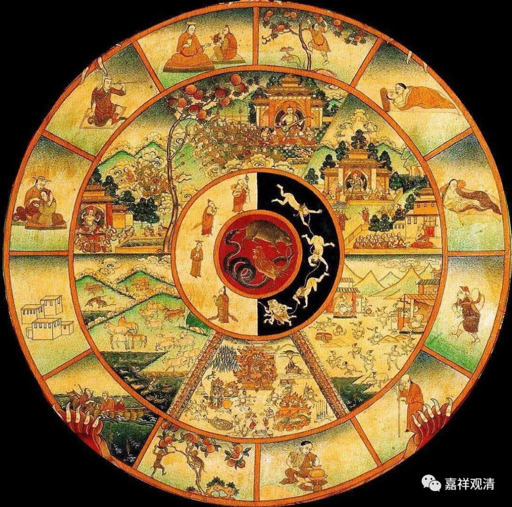

**《菩提速道》099（中）**

其实我们周围蛮多事情已经在提醒我们了，可以说很多衰相已经开始表现了，但是我们都没有感觉，或者说都这种感觉被遮掩起来了。吃东西的时候，就不像以前那么觉得好吃了，别人说好吃的自己都不觉得好吃，或者吃下去有不消化了……而且我们总觉得是新的问题出现了，比如说我们总觉得眼睛的问题，只要少看点手机就好了。我们熬不起通宵了，吃多了真的会撑了，身体发福了……

其实真相就是，我们的身体已经衰弱下去了。就好比打拳，我们打了一会，身上就大汗淋漓，人家练武的，和我们一起打拳，人家连汗都没有出，是我们的身体不行了啊。走路也是一样，以前爬十楼都不觉得累，现在稍微走几步楼梯，膝盖都有问题了。这些都是慢慢表现出来的，其实都是在给你提醒的，只是你都没有感觉。

不需要哪一天收到阎罗王的邮件“你老了”，其实随时可以发现衰相现前。天人的“五衰相”是一下子来的，所以不堪忍受，而我们是慢慢积累的，所以好像无动于衷……

** “另外，又说：‘诸天人从天界堕落时，产生的极大痛苦之量，有情地狱的苦也赶不上它的十六分之一。’”**

** **

这是举例来说。对于高位的人，告诉他将被撤职下放，对于他来说，这种苦就是挺严重的。而一直在底层的人还没到这么痛苦的感受程度。

** “（二）即便成办了上界的取蕴，也没有安住的自由，过去的善业一旦牵引力尽，又将堕入恶趣，承受无量的痛苦。**

** **

即使投生到看似安乐的天界，但仍旧在无常、无边的轮回中，终有一天，善业享受完了，恶业现前，则又到下界受苦。

若不解脱（free），轮回就是一个死循环。

** **

** 不仅如此，《忏悔赞颂》中，说生于上界的凡夫异生，由于遮止了分别观察慧的续流，经劫长住，后虽生于欲界，多为愚钝无知之类，于证解脱极为迟缓。”**

** **

就是天界当中有一类，他老是处于禅修当中，他的脑子不怎么用，习惯性的思维不怎么用就变成习惯，那么常常在下一生带着这种不动脑筋的习气，成为愚痴增上的有情，这对于需要智慧抉择得到的解脱将带来很大的障碍。

** “总之，这个五取蕴是今世生老病死等的所依，能引生现后二世的苦苦和坏苦，并且一旦成办取蕴，即被行苦所主宰，因为随宿业及烦恼转的一切诸行就是行苦谛。**

** **

总之，烦恼而带来的这个身心就是生死的容器，只要烦恼还在，今天和将来，终究摆脱不了苦苦、坏苦、行苦的伴随……

        修改于