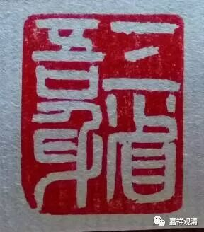
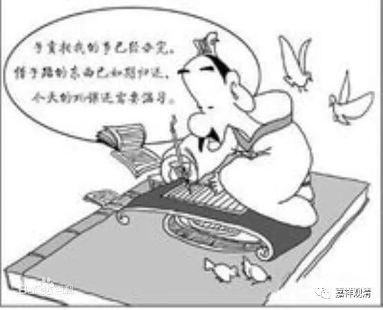

**《菩提速道》099（下）**

** 因此，无论如何也须证得上师天的宝位，从取蕴为性的轮回中解脱出来，惟愿上师天加持令我能如是而行！**

** **

** 这样祈祷以后，观想顶上上师天身分中降下五彩光明甘露，注入自他一切有情身心之中，自他一切有情无始以来所集的一切罪障皆得以净除，尤其净化了如是如是的障碍，……，自他一切有情心中生起了如是如是的殊胜证悟。”**

** **

这个呢，就是观察轮回苦。轮回苦里面有总的苦和别的苦，有三恶道的苦，也有三善道的苦，我们前面都讲过了，大家可以多想一想。

有一点我需要提醒大家的，我们都已经学会了辩论，是吧？如果是在辩论的时候，那你一定可以为“轮回当中不永远都是苦”找到理由的。但是现在我们是要修行，是要你对轮回的苦生起认知，那你就要为这个苦来找理由，而不是为不苦来找理由。你要是认为轮回不苦的话，你就不会想要逃离了嘛。

所以，现在对这里的修行来说，你就是要生起轮回是苦的这个心，暂乐的这个心根本不要生起。有人说：“苦和乐是相对的嘛，有苦就肯定有乐嘛！”昨天是哪个人说的呀？这种政治不正确的话居然敢在这里说，我当时没有一脚踢走算是好的了。

这个就是思维苦。

** “庚三、结行：如前所说。**

** **

** 己二、座间如何行：此当参阅开示一切轮回为痛苦自性的经论及注释等同前。”**

** **

那么，在学习了这些内容之后呢，就应该去翻阅一下相应的经论。

其实周围所有发生的事情都是可以提醒你轮回苦的，就怕你自己不想。你看谈恋爱和结婚也是一样嘛，你老是想着她的好，就结婚了。然后你又老是想着他的不好，那就出离了。

** “戊二、抉择趣入解脱道的体性，分二：**

** 己一、座中如何行。**

** 己二、座间如何行。**

** 初者，此中分三：**

** 庚一、加行。**

** 庚二、正行。**

** 庚三、结行。**

** 初者，加行：**

** ‘遍摄依处上师殊胜天，能仁金刚持前诚祈祷’之前如前所述。**

** **

** 其后当思惟：**

** **

** 我及一切慈母有情沉没在轮回之中，受尽种种长时剧烈的大苦，都是因为没有生起希求解脱的心从而如理地修学三学道所导致的。现在惟愿上师天加持，令我及一切慈母有情心中既得生起希求解脱之心后，复能如理地修学三学道！**

** **

** 依于这样的祈祷，观想顶上上师天身分中降下五彩光明甘露，注入自他一切有情身心之中，自他无始所集的一切罪障皆得以清净，尤其障碍生起希求解脱之心后如理修学三学道的一切罪障皆得以清净，身体变为莹澈的光明之体，一切福寿教证功德增长广大，特别是自他一切有情心中皆生起希求解脱之心后，复能如理地修学三学道的殊胜证悟。”**

** **

这些心呢，都是要生起的。那么相应的障碍呢，也要消除。每次在正行之前的观想就是这样，这是加行，然后就是正行。

实际上“好多事情都是后来才看清楚”的。而这个“后来才看清楚”，就是你自己的反省了。其实是你当时没有反省，如果当时立即反省的话，也是有机会可以看清楚的。这个就是“正知”的力量，而我们平时都不去观察。所以反省很重要，我们要养成反省——观察自己的习惯。曾子曰：“吾日三省吾身……”，抽象地来说，很有道理！

好，我们今天上午就学到这里。

愿以此功德，普及于一切。

我等与众生，皆共成佛道。

