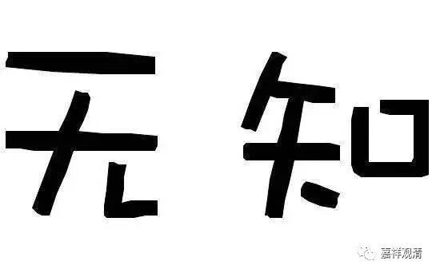

**《菩提速道》讲记100（上）**

好，我们继续学习《菩提速道》——第五世班禅大师的道次第名著。

道次第的内容当中比较重要的就是这些科判，这一个个的条目就是它的核心。那么，这一个个的条目就是我们应该生起的心，然后在这一个个的条目之下就是进行证明的理证、教证和例证。

正如前面所讲的，这些理证、教证和例证，如果你愿意的话，你也可以自己来写一本书。如果你熟读成诵的话，至少你也可以有自己在上座时观想的内容。而且，也不见得每天要观想的内容都完全一样（每天内容一样……至少我觉得挺枯燥的）。

我不知道你们大家怎么样，反正我每天观想一样的内容会觉得很烦。当然，打坐的数息观另外再说。如果每天的观想都一样，我做不到。这是什么星座的人啊，可以做到每天观想都一样？他的思维定式很厉害的嘛。要么山本五十六也是摩羯座的（他每天按照固定的作息、严格照计划行事）？可以查一下哦。

** “庚二、正行：**

** 在顶上修习上师天的状态中，如是思惟：”**

** **

这里“在顶上修习上师天的状态中”的意思是，好像预设了这个条件还存在的情况下，然后再进行观想，好像有一分心还一直在那里——师父一直在脑袋顶上。

** “心识就其本身而言虽然是无记性（善、恶、无记三性之一）的，”**

** **

心的本身是无记性的。其实，心的本身到底有没有呢？我们可以考虑一下。

** “最初，由于缘我及我所，生起执着自性成就的心。由于它执着我，因而爱自品，嗔他类，心执自己比他人强的我慢心等颠倒见生起，由此对开示无我的大师及彼开示的业果、四谛、三宝等，生起拨有为无的邪见和疑心，进而滋生蔓延其他的烦恼，复由烦恼自在，积聚诸业，无奈地在轮回中虚生浪死，承受种种的痛苦。”**

** **

“虚生浪死”，哇，真是文学家啊！（缘宗法师）他是中文系毕业的吗？哦，也是学医的呀。）学医的人文笔都很好啊！比如邰正宵，比如罗大佑，比如鲁迅、郭沫若……还比如观清，是吧？

** “故尔，一切痛苦的根源，追根究底就是无明！”**

** **

无明，就是它了！无知是种种苦和烦恼的本源！“无明”，玄奘大师常译为“无知”。

有一个漫画：上帝也许嫌弃撒旦，如果是释迦牟尼，也许拍拍撒旦的肩膀，对他说：你也不是坏，只是无知。这算是抓到点子上了，佛教认为，无知是贪爱、愤怒这些烦恼、行为的原动力。

** “如《释量论》中说：**

** ‘一切过患根，是为坏聚见。’**

** ‘若谁见于我，即爱于此我，**

** 爱故耽安乐，耽之不见过，**

** 见德愈耽恋，即取为我所，**

** 是故若著我，彼即漂轮回。’**

** ‘有我故知他，执自嗔他分，**

** 与此而相系，生一切过失。’**

** **

《释量论》（法称作）说：因为我执，而有了种种贪爱、嗔恚，漂泊于轮回……所以一切系于轮回的过失，起因都是——无明！

** **

** 《入中论》中说：‘最初说我而执我……’等。**

** **

《入中论》中也说，众生随缘起执，执“我”与“我所”……

