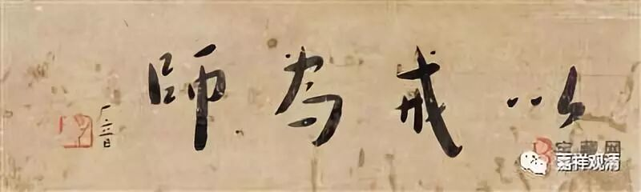
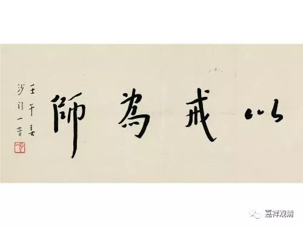

**《菩提速道》100（中）**

** 因此，我无论如何也要证得断尽一切轮回痛苦的最胜解脱——清净圆满的佛陀宝位，为此当如理地修学珍贵的三学之道。”**

** **

珍贵的三学之道，就是戒、定、慧。正式的踏入解脱的路，要修学的内容就是“三学”。

** “清净地守护（戒律）有着极大的利益，若不能守则有着极大的过失。**

** 如《珍爱比丘经》中说：**

** ‘或有戒为乐，或有戒为苦，**

** 具戒则安乐，毁戒则成苦。’”**

** **

在《阿含经》和《戒经》当中都有这一段。说明佛陀经常说这段话：受了戒并遵从、守护，则现后世安乐；反之，毁坏戒律，则眼前、将来衰苦显现。

** “较之布施无量的财施，能于佛法欲灭的此时，仅一日一夜中守护净戒的功德更大。”**

** **

现在我们处于佛教所说的末法时代，整个佛法都比较衰弱，如果谁有一点对戒律的护持，大家都会看得见，也会有很多的人因此而学习和赞叹戒律和戒行，别人也会有赞叹和随行的功德。

困难的时候困难的行持，相应的，得到的功德也会大——这是从功利的角度来讲，说起来，这本是行者“应该做的”。

** “如《三摩地王经》中说：**

** ‘若经俱胝恒沙劫，净心以诸妙饮食，**

** 伞盖幢幡及灯鬘，承事百亿俱胝佛，**

** 若于正法极失坏，善逝圣教欲灭时，**

** 昼夜能行一学处，其福较前尤超胜。’”**

** **

正法衰弱时，如果能够昼夜行一个学处，那么由此获得的好处比前面供养无量世尊的这么多的好处还要超胜。

不过，这个和前面所讲的（毁戒为苦等）又似乎有冲突：一个末法的行者，从正面来说，奉行守护哪怕一个学处都有这么多超胜的福德；另一方面，受持很多学处，都是稍一违犯就要下到畜生地狱道，甚至还要下到无间地狱……前者是欲让你生起希有心，后面是让你生起护戒想。

