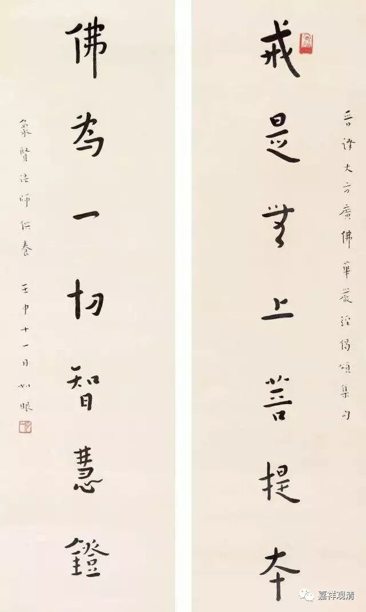

**《菩提速道》100（下）**

** “若不守护（戒律），则有极大的过患。说过去迦叶佛应世之时，有一比丘轻慢佛所制戒，折断了一根树枝，由此生入龙中，头上中间长有一棵很大的多罗树，至今仍受着无量的大苦，未来还将继续受苦。**

** **

这是说，若护小戒有大功德，若违小戒有大过患。我们应该谨慎谨慎再谨慎。像我们现在，应该忏悔忏悔时时忏悔了。

** **

** 如经中说：**

** ‘现或有于王重禁，违越而未受治罚，**

** 非理若违能仁教，如医钵龙堕旁生。’**

** 因此，我当如理地修学戒法，就算失坏生命也不舍弃自己如何承许的戒律。如是思惟。”**

** **

我们应该好好的学戒律，行持戒律、守护戒律——这个其实是应该要特别强调的，但是好像现在对此强调得很少，大家好像不是很在乎，甚至在一些传法法会当中，大家也都没把戒律当回事。有时候我们把那些戒律的内容打印了发给大家，大家好像也是不重视，看都懒得看，今天才受的戒，明天就犯了。我觉得这些人根本是不信佛的吧。

很奇怪啊！明明跟你讲了，这些戒律都摆在那里要遵守的，而且持守这些戒律都不是为了你坏，都是为了你好。那么，你既然自己选择了受戒，结果第二天就去犯戒或者就直接破戒，这个是什么意思啊？！这和买一瓶杀虫药去喝有什么区别啊？没区别嘛！

戒律，对于我们来说是非常重要的。现在有些僧团，可能在学习上并不怎么样，但是至少持守戒律，那至少可以保证他们会经常地去正面学习，至少可以保证他们堕落的机会小了很多。

如果按照这里的话来说，修学戒律的功德会很大，非常非常地大。所以从这个角度来说，我觉得很有趣、很可悲，现在大量号称学修密乘的人其实根本就不信佛的，他们肯定是根本不信佛的。我说这个肯定可能有点过分，但确实看到很多很多很多的现象，都不知道说什么好了。

戒律当中最根本的是三皈五戒，如果你连三皈五戒都做不好，那你受了密乘戒，真的就像自杀一样。和自杀有什么区别呢？所以哪怕是学佛的其他方面都没有做好，只要把戒律持好就好。即使其他方面都做得很好，但是戒律没持好，那就完了！“先得增上生，后得决定胜”，先保证不堕落，之后才谈解脱啊！

这些人真是奇怪啊！这样简单的因果怎么会分析不出来呢？你一定要把前面的都做好，后面的才会有你的份嘛。如果前面连戒律都没有持好，后面的十地菩萨的法和你有关系吗？

唉，非要找理由的话，可能是“文化”差异吧，师父们在传法时，他们根本不知道你们会不把戒律当回事，他们认为你们既然信佛，都是至少应该会把戒律当回事的。最后呢，因为这些不把戒律当回事的事情实际发生了，师父们的心也会跟着改变，师父们的心里就产生了另外一种想法：“反正这帮人全都是要下地狱的，和佛法结过一个缘下地狱，总比完全没因缘要好一点。”

