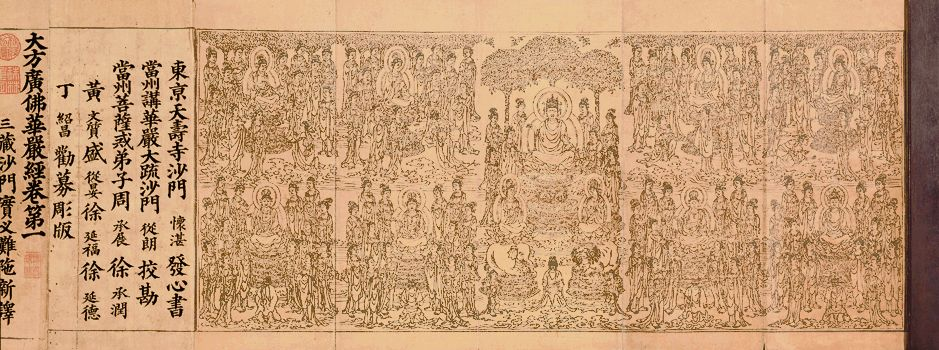

**《菩提速道》讲记101（上）**

受学密法是应该要非常谨慎的，受戒律更不是让你去违犯的。这一点是很肯定的，受持戒律就是为了让你好好地做人，为解脱做准备。当初释迦牟尼佛制定这些戒律，都是为大家好，是令大家依安乐而趣解脱的，根本不是为你坏的。但是我们很多人现在真的不把戒律当回事儿了。前两天还碰到这种情况呢，一个自称学过密法且受了大量戒律的人，不仅吃海鲜，还在网上炫耀。（顶差顶差，你也要瞒着不说才是啊！）真是一点惭愧心都没有！不可救药！

我对大家的要求其实也是这样，你们这一辈子不学密法我都觉得没什么，但是如果不把戒律持好，那就完全是自找苦吃。戒律没持好，那后面的东西学了都没意义。有意义吗？我觉得没意义。增上生都没把握，决定胜的解脱道理你还远着呢！

** “因此，我当如理地修学戒法，”**

** **

所以，大家应该好好地做到持戒——戒为无上菩提本，长养一切诸善根。

《华严经》说：

“若信恭敬一切佛，则持净戒顺正教；

若持净戒顺正教，诸佛贤圣所赞叹；

戒是无上菩提本，应当具足持净戒；

若能具足持净戒，一切如来所赞叹！”

** “就算失坏生命也不舍弃自己如何承许的戒律。”**

** **

你承诺的戒律、规矩、承诺，你就要去做到嘛，要不然你承诺了干吗呢？前一天刚刚承诺好，后一天就毁犯，何必呢？骗佛？骗师父？骗自己！

** “如是思惟。”**

** **

我们应该这样想、这样守护戒律。守护戒律不是为了师父，也不是单纯为了不堕落，长远地来说，是为了究竟解脱。

** “无知是生起罪堕之门，”**

** **

因为你在前面不学习，所以就会无知，就不知道该怎么做，所以无知是生起罪堕之门。因此，首先我们就应该要学戒律。

** “它的对治法是当听闻了知学处。”**

** **

受了戒，就应该知道这些戒律的内容是什么，不知道这些内容的话，你学什么呢？（这里的“学处”指的是戒律。）

碰到有些人，对自己奉持的戒律完全无知，更不论开遮持犯了，这样的情况，学生自己有很大过失，启蒙老师至少得负有部分责任。

