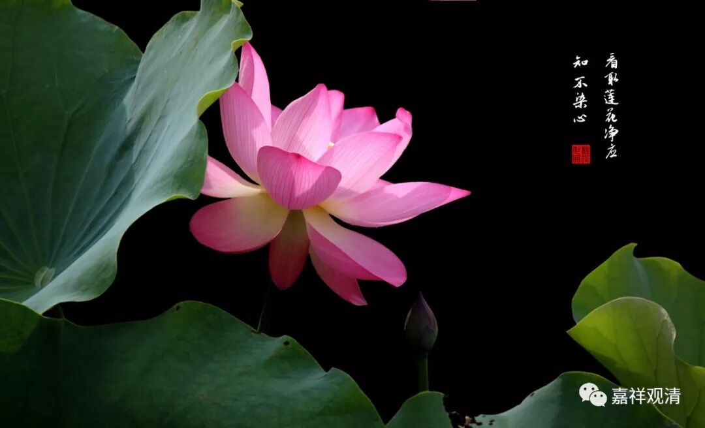

**《菩提速道》101（中）**

** “了知之理者：应当如理依止善巧而不坏戒严、戒严而不坏善巧的具相善知识，最好对于圆满的道次有所了解，否则，也应对于仅是学修总菩萨行以下的内容有所了解，不然，也当对中下士道两者有所了解。然后，若是沙弥，应看《嘎热嘎五十颂》及《沙弥学处三百颂》它们的注释而了知。若是比丘，则应研读比丘的诸种学处，至少也应阅读班禅一切智文集中的《学处略摄》，或者法王一切智所著的《比丘学处略摄》，令了然于心中。若已获得无上部的圆满四灌顶，则须学习《戒律二十颂》等菩萨学处和《根本堕及粗罪之安立》，了知以后则应付诸实践，这是不容缺少的。”**

** **

《沙弥律仪》、《比丘学处》这些是出家众的学习内容，虽然对居士们来说，未必是要学习上面的这些书，但是和戒律相应的内容都是我们应该要学习的。《菩萨律仪二十颂》、《瑜伽菩萨戒品》这些是居士也可以学习的。

我又想到了一个人。我们要不就报报他的名字吧？色拉杰的SNSB格西。在江湖上名气坏得要命，根本就不像个格西的样子，简直是那种自己下地狱还要拖着大家一起下地狱的人。居然还是头等格西哦。他在寺院里面学习的时候，就拿着刀想砍师父。现在呢，每一两年都要勾个女人拍拍照，是吧？一直在江湖上恶名远扬。

然后他还要给别人灌顶，偏偏自己对灌顶的内容一点也不懂，就随便找了一个或者从网上下载一个仪轨就跑去给别人灌顶了。最后，别人都在劝他还是不要灌顶了，这样很不好，就等于自杀，他还大言不惭：“反正他们就是相信我嘛，我怎么说他们都会认为是对的。”大致是这个意思，他根本不相信因果的嘛。他在寺院里面呆了二十多年，拉仁巴格西倒是考出来了。唉，他就是不相信因果的，不然这么会做这种黄腔走板的事情呢？或者是要给我们演示一下因果的报应，是吧？我想看看他接下去是怎么样子的。

** “不敬是罪堕之门，其对治法则应于大师、大师所制的诸种学处、如理修学学处的同梵行道友生起恭敬。”**

** **

不恭敬佛陀制定的戒律也是一样的。

还有一点，就像我今天上午讲过的，用上海话来讲，“轧道”很重要。如果你周围的朋友，或者你一起学习的圈子里面，大家都对戒律很尊重的话，那么你在这个圈子里，你也会觉得戒律是很重要的。如果你周围的人都觉得戒律不重要，那你进入这个圈子的时候，你也就根本不觉得戒律是重要的——这是非常可惜的。

我还记得过去二十年左右或者十几年左右，在汉传的格鲁系统，差不多就是海公上师的系统当中，可能大家对于佛法的其他内容也都不怎么了解，但是对于戒律这个东西大家都非常地认真。大家都知道一定不能如何如何，宁愿晚一点学习密法，甚至不学密法都没有关系，但是在戒律方面绝不能有任何故意违犯、不当一回事的心去做。

从这一点可以说，今天的江湖是越来越乱了，真是太糟糕了。这样不把戒律当一回事的圈子简直是一天也呆不下去，看到这些人就烦。当然，这也是我这个人嗔心比较重的原因吧。我要修慈悲观——祈请佛菩萨降下五彩的甘露，把我的嗔恨心消除，生起慈悲心。好，现在我的脸色和悦了。

 