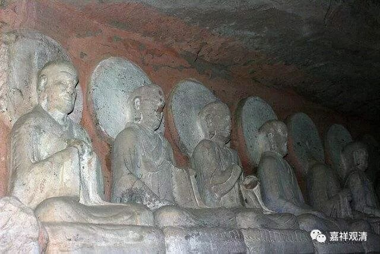

**声闻最极三生涅槃**

** （三）**

** 《瑜伽师地论》所许**

下面谈谈唯识宗是怎么理解“声闻涅槃久近”的，来看《瑜伽师地论》。单纯从《瑜伽师地论》来看，文字略接近《大毗婆沙论》和《顺正理论》，但相对比较中性，很难确定义理上更接近众贤还是世亲。《瑜伽师地论》卷二十一说：

“当知此中，或有一类极经久远；或有一类非极久远；或有一类最极速疾得般涅槃。

谓住（声闻）种姓补特伽罗最极速疾般涅槃者；要经三生：第一生中最初趣入，第二生中修令成熟，第三生中修成熟已，或即此身得般涅槃。或若不得般涅槃者必入学位。方可夭没极经七有得般涅槃。”

《瑜伽师地论》说“第一生中最初趣入”，和《大毗婆沙论》“第一生中种善根”、《顺正理论》“初生殖顺解脱分”、《俱舍论》“初生起顺解脱分”，没有差别。

关于“第二生”的趣入分位，《瑜伽师地论》说“修令成熟”，这是比较模糊的说法，它既可以解读为《大毗婆沙论》的“第二生中令成熟”、《顺正理论》的“次生成熟”（即资粮位的成熟），也可以解读为《俱舍论》的“第二生起顺决择分”（成熟至加行道）。

关于第三生，是从第二生的成熟分位直至解脱，《瑜伽师地论》、《大毗婆沙论》、《顺正理论》、《俱舍论》从这点上来说可以说没有分别（具体从资粮道开始还是加行道开始则有差别）。

《瑜伽师地论》文字本身略有模糊性，但瑜伽行派的论师们却有很清晰的解读——略近世亲说而更细化，同时不取《俱舍》“入根本定得加行位一生必得见道”之说。如《瑜伽师地论遁伦记》卷六：

“总有三类：

一、极久远者声闻极多经六十劫修解脱分善根最后身般涅槃。

二、非极久远者有经多生乃至一劫方般涅槃。

三、最极速疾得般涅槃者要经三生。

第一生中，发心修习解脱分善，谓五停心观、总别念处。

第二生中，复修念处，从总念处修趣煖、顶，或入下忍，或入中忍，名为“成就”（此处“成就”，当作“成熟”）。

第三生中，复从下忍，或从中忍起增上忍，世间第一，入于见道乃至究竟阿罗汉果。此人或时于第三生得入圣已，于初果身命终受生受于七有方便般涅槃。”

《遁伦记》说，声闻最速的涅槃者要经三生：

第一生入资粮道，修五停心观、总别念处；

第二生从总念处开始，进入加行道，历经加行道之暖位、顶位，登加行道忍位。其中有二，或入下品忍位，或入中品忍位（不堪入上品忍位）。

第三生，从加行道下中品忍位起，次第入上品忍位、世第一位、见道位、修道位、究竟位。

《遁伦记》在解释《瑜伽师地论》第二生中“成熟”时，就是以“至加行道忍位”来解释，而非如有部系统指资粮位的“成熟”。他对《俱舍论》之前说的“依根本地起暖等善根，彼于此生必定得见谛”之词选择无视，不加辩解。

