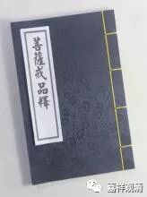

**
**

** 《菩提速道》101（下）**

** “放逸是生起罪堕之门，其对治法应以自为因而有惭，以他为因而有愧，生起正知正念有惭有愧后，住于不放逸。”**

** **

放逸就是你没有用正知的心来观察自己嘛，放逸了，就过去了。这有点相当于什么呢？假如说美国所有的卫星都被我们打掉了，那我们不管做什么事情他就观察不到了嘛。我们的这个正知都被打掉的时候，那你的坏心在干什么，你也不知道了，这就是放逸。所以我们应该努力地升起几颗卫星啊，比如说我们的北斗系统——我们北斗系统是好的，现在已经布局很多颗卫星了。

** “烦恼炽盛为生起罪堕之门，其中贪心的对治为修习不净观；嗔恚的对治为修慈心观；愚痴的对治为修习缘起观等。应励力于任何时候不令罪过沾染的清净戒律！惟愿上师天加持令我能如是而行！”**

** **

其实在讲菩提心之前，可能戒律真的应该年年讲、月月讲、日日讲，应该像阶级斗争一样牢牢地扎根在我们的内心深处——以阶级斗争为纲。

烦恼特别炽盛的话，有分别对治的方法：不净观对治贪欲，慈悲观对治嗔恚，缘起观对治愚痴，数息观对治散乱，界分别观对治慢……

** “由于这样的祈祷，观想上师天身分中降下五彩光明甘露，注入自他一切有情身心之中，自他一切有情无始以来所集的一切罪障皆得以净除，尤其净化了如是如是的障碍，……，自他一切有情心中生起了如是如是的殊胜证悟。”**

** **

这个大家不妨多修啊。不过呢，这个只是座上的修，相比座下的修，可能座下的修在这方面更加重要。所以你应该要阅读相关的经典，听闻相应的教法，否则呢，仅仅是在打坐的时候有一些概念，好像看电影一样。

** “庚三、结行：如前所说。**

** 己二、座间如何行：于座间也应当多阅读别解脱戒为主的学处等如前。**

** 对于共中士道次的修心，于此讲说完毕。”**

** **

出家的僧人就有很多戒律方面的书可以读了……

对居士来说，这有点麻烦，为什么呢？因为几乎没有专门讲五戒的经论。那么，在早期的阿毗达磨——《舍利弗阿毗昙论》当中是有专门讲五戒的部分，其他的经论当中呢，专门给居士看的关于五戒的部分是没有的。汉地是有一些专门讲五戒的论著的，比如弘一法师写的《南山律在家备览》，它更像是律学的著作，而不很具有实操性。这部作品更像是研究文献，大家有兴趣的话也可以看一下。

菩萨戒部分对居士是建议阅读的，推荐《瑜伽师地论·菩萨戒品》，宗喀巴大师、太虚大师都有解释。

