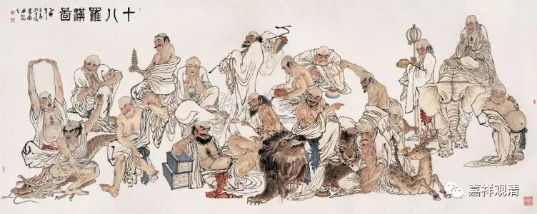

**声闻解脱久近**

** 中观唯识对声闻解脱时间上限的看法**

《瑜伽师地论》里没有谈及声闻解脱最多需要多久，但《遁伦记》有提及，如有部师说，《遁伦记》也认同《大毗婆沙论》和《顺正理论》所说的“声闻极久经六十劫获上品解脱”。如《瑜伽师地论遁伦记》卷六：

“一、极久远者，声闻极多经六十劫修解脱分善根，最后身般涅槃。”

同时说到，中品的经多生（三生以上）乃至一劫。《瑜伽师地论遁伦记》卷六：

“二、非极久远者，有经多生乃至一劫方般涅槃。”

中品和上品之间，还差了一劫至六十劫的中间部分没有提到。

即：

一劫 < Z <六十劫

这个“Z”的时间段，要么根本（法尔）不存在在这个时间段里成就的罗汉，要么就是尚待补充。从之前舍利弗由大乘退堕成阿罗汉的角度来说，这个时间段里必然是存在成就的阿罗汉的——不能说只能六十劫退堕而不能五十九劫退入声闻乘吧。

另外如基大师，他在为《瑜伽师地论》注解时也补充了六十劫为声闻解脱时间上限的说法。《瑜伽师地论略纂》卷十一：

“……若约增上，四生乃至六十劫为修习者，即于现身，亦入涅槃……”

这里的“四生”指中品的下限，“六十劫”，则指上品（上限？）的时间。可见基师也取有部的“声闻解脱极久经六十劫”的说法。

再看中观。《大智度论》卷二十八说：

“……如声闻，疾者三世，久者六十劫……”

谈到声闻解脱极久经六十劫。若据《大智度论》全篇前后文来看，《大智度论》的作者未必认同此说，但至少也在把它作为一个常见的知识点向大家介绍。

