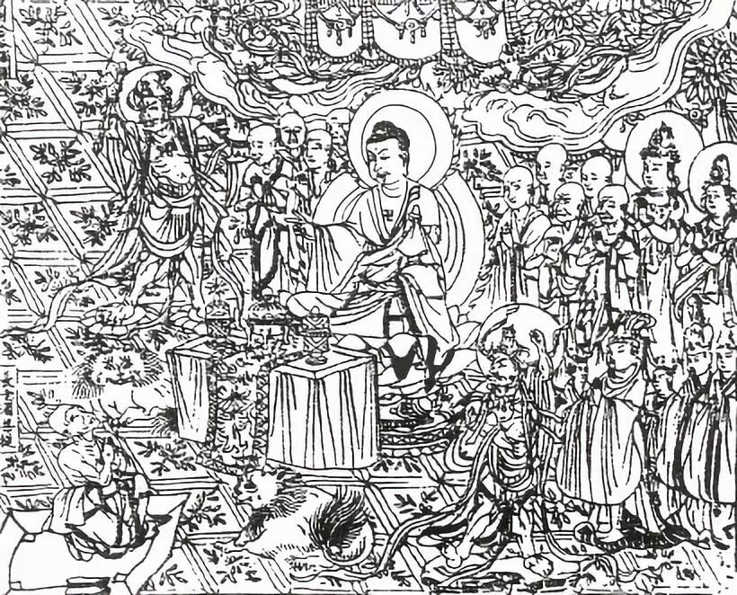
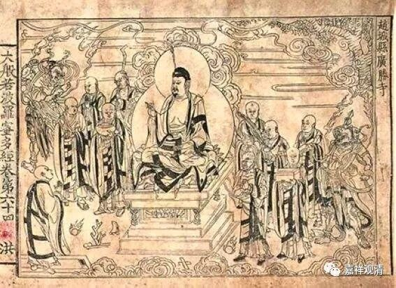

**《菩提速道》102（中）**

一般我们会讲“五种”姓，以前唐老也讲五种姓，而现实意义上好像差不多就是这样的。从现实意义上来看，好像真的有这样五种人。

记得那次一早陪唐老在小河边散步，我问的类似种姓问题。唐老说：“你看伸出手来。手指也有长有短嘛……”我心里不是太满意这个比喻，忍住没敢顶嘴，怕被骂“放屁！放屁！！放马屁！放狗屁！放猫屁！放耗子屁！”

我个人觉得，五种姓在现实意义上是存在的，但在究竟意义上，究竟一乘才是合理的。现实层面，确实看到有这样五类人。

一种人就是，你怎么跟他说，他也不信佛的，哪怕你在他面前堆起金山，举起大斧，他也不会真的信佛。

一种人是碰到谁就跟谁。我有个同学就是，他几乎把现存的所有佛教的宗派都学了一遍，最后学净土，从了JK法师。他真的是，一碰到就觉得：“这是世界上最好的，没有比它更好的了。”然后就学了。不久又碰到一个：“哦！这个才是最圆满的。”比如他学了格鲁，就觉得：“哦！格鲁这个上师供，以前居然没发觉。嗯，现在格鲁的上师供最好，是成佛最快的法门。”之后又碰到马头明王，忽然之间就觉得：“哦哟！密法当中，宁玛派XXX法师传的马头明王，这个是成就最快最快的了。”最后打电话给我了：“我现在觉得一句‘阿弥陀佛’是成佛的无上法门。”这种人可以比喻不定种姓。

还有就是定姓的声闻和缘觉。我们在江湖当中也可以看到很多，有时候碰到南传的一些人就有这个情况哦。

定姓的大乘种姓的人，其实不多的。我们的心，大部分都是“游走姓”的。

以前跟唐老学习的时候，曾经在唐老面前很“小明”地问过他（不是河边散步那次，有可能是散步回来）：“那我是什么种姓呢？”唐老当时就给了我一颗定心丸：“你在我这里坐着（来学唯识），那至少是‘不定种姓’的。”（哎，唐老是不是在骂我呢？我会不会理解错了呀？他其实是在损我吧。嗯，有可能。）

要趋入大乘道，真是很不容易啊！

依道次第，除少分（如二乘不共之发心）以外，声缘之所学修的都是大乘道的台阶，都可以摄在大乘道当中。

