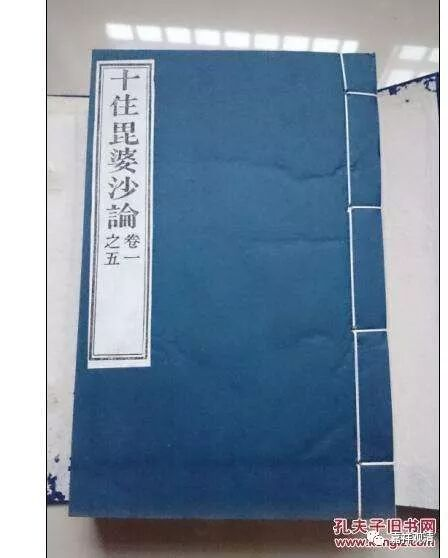

**中观师对三乘行者解脱久暂的终极答案**

中观论师的对“声闻、缘觉几时度生死”的观点，在《十住毗婆沙论》中更明显地表现出来。

《十住毘婆沙論》卷一：

“问曰：行声闻、辟支佛乘者，几时得度生死大海？

答曰：行声闻乘者：或以一世得度、或以二世、或过是数，随根利钝，又以先世宿行因缘。

行辟支佛乘者：或以七世得度、或以八世。

若行大乘者：或一恒河沙大劫，或二、三、四至十、百、千、万、亿〔恒河沙大劫〕【此句《藏要》版作“二、三、四、五、十、百、千、万世”亦具可通，而以前说为善】，或过是数，然后乃得具足修行菩萨十地而成佛道，亦随根之利钝。又以先世宿行因缘。”

《十住毗婆沙论》说：声闻得解脱（“得度”），一世也有，二世也有，超过也有，主要看他的根器利钝，和宿世的因缘。

缘觉呢，有七世的，也有八世的（这里按前后文看，前后都有缩略）。

大乘的呢。有一恒河沙劫成佛的，乃至二、三、四、五、十、百、千、万、亿恒河沙劫乃至更多的都有，也是主要看他的根器利钝，和宿世的因缘。

《十住毗婆沙论》的意思是说：长短都不一定，当看根器利钝和宿世因缘。相对来说，成无学道的时间，声闻乘 < 缘觉乘 < 大乘。这是龙树及其早期及门弟子一贯的“一切皆有可能”的说法，很中观，很龙树。

《大智度论》卷四在批评《发智论》所许成佛时限差别时说：

“摩诃衍人言：是迦旃延尼子弟子辈，是生死人，不诵不读摩诃衍经，非大菩萨！不知诸法实相，自以利根智慧，于佛法中作论议，诸结使、智、定、根等于中作义，尚处处有失，何况欲作菩萨论议？譬如少力人跳小渠尚不能过，何况大河！于大河中则知没失。”

说：有部（迦旃延尼子弟子辈）的那些凡夫（生死人），不读大乘经，用自己的聪明智慧在佛法中做抉择，便生种种误失……这是说，有部说的那些三乘人解脱的时间界限，都是他们自己看书自己想出来的，不可凭信——这一批评，放在这里也可以用，可以当作是龙树及其及门弟子对三乘解脱时限的总批评。

