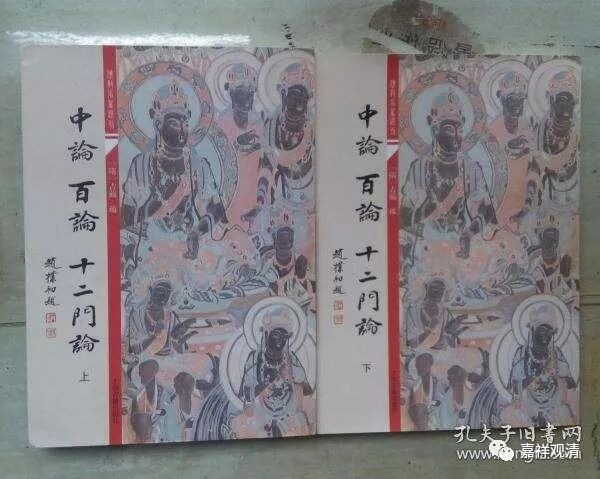

**试论嘉祥吉藏三论《疏》的完成先后**

公元602年，隋仁寿二年，吉藏54岁，隋文帝杨坚敕吉藏撰《净名疏》、《中论疏》和《十二门论疏》；

此中《净名疏》即《维摩经义疏》，吉藏于公元604年，隋仁寿四年，56岁时撰成《维摩经义疏》。

至公元608年，隋大业四年，吉藏60岁时，撰成《中論疏》、《百论疏》、《十二门论疏》，其中《十二门论疏》应该撰成最晚。

《十二门论疏》卷中：“……《百论疏》已具明之。”则《十二门论疏》之撰成当在《百论疏》之后。而《中观论疏》最广，故最在前。

《中论序疏》云：“予昔在江南寻之（僧睿所撰之《<中论>品目释》）不得，至京访问又无，当是失落也。”吉藏进京（长安）在公元599年，隋开皇十九年，吉藏51岁时。则《中论序疏》之作当在此后。

《十二门论序疏》有云：“大业四年六月二十七日疏一时讲语……”《百论序疏》云：“大业四年十月，因讲次直疏出，不事访也……”则《十二门论序疏》之作在《百论序疏》之前。《十二门论疏》成篇在《百论疏》之后，而《十二门论序疏》撰成在《百论序疏》之前，如此，则三论《序疏》，乃各自独立于本论之疏而完成。

这样，吉藏的三论《疏》和三论《序疏》完成的次序可能的先后顺序是：《<中观论<疏》、《<中观论序>疏》、《<百论>疏》、《<十二门论>疏》、《<十二门论序>疏》、《<百论序>疏》。

三论注疏的最终完成是嘉祥吉藏大师创立（新）三论宗（之前称为古三论师）的标志。

