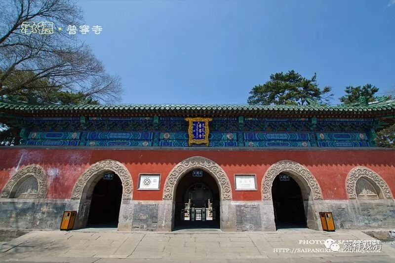
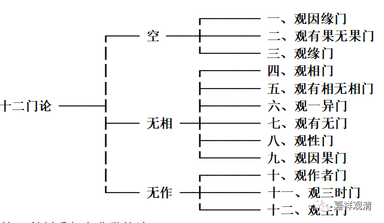

**一、吉藏对《十二门论》的第一种科判**

** “三解脱门”甲版**

先来看第一种科判。此出《十二门论疏》卷上《观因缘门第一》：

“门虽十二，不出三空。初有三门，求有法不得，名为‘空门’；次有六门，求相无踪，谓‘无相门’；後有三门，求起作无踪，即‘无作门’。”

这里的“三空”，是指的“三解脱门”：空、无相、无作。

此一科判中，属“空门”者有三：观因缘门、观有果无果门、观缘门；

属“无相门”有六：观相门、观有相无相门、观一异门、观有无门、观性门、观因果门；

属“无作门”有三：观作者门、观三时门、观生门。

这一科判在后面的疏释中也得到印证，如《十二门论疏》卷中《观相门第四》：

“此下……名‘无相门’……”

这里说第四品以下开始“无相门”，则上三品属“空门”。

又，《十二门论疏》卷下《观作者门第十》：

“上明二门讫，今第三，竟论，释‘无作门’。”

三门有浅深，无有浅深义。

无浅深者，一一门无病不破，无理不显，故门初门后，皆唱一切法空。

有浅深者，‘空门’破有，‘无相门’破空。此二门非有非空，即中道境、中道观。今门（无作门）明息观。故三门空有并亡，缘观俱寂，所以论明三门也。

这里说第十门《观作者门第十》以下到论终（《观生门第十二》）为“无作门”，则“无作门”有三。

把第一种科判做成表，如下：

《十二门论疏》大科表一

**        ┌──── 一、观因缘门**

** ┌── 空 ──┼──── 二、观有果无果门**

** │              └──── 三、观缘门**

** │              ┌──── 四、观相门**

** │              ├──── 五、观有相无相门**

**   十二门论 ───┤             ├──── 六、观一异门**

** ├── 无相 ─┼──── 七、观有无门**

** │              ├──── 八、观性门**

** │               └──── 九、观因果门**

** │               ┌──── 十、观作者门**

** └── 无作 ─┼──── 十一、观三时门**

**            └──── 十二、观生门**

这一科判看起来非常简洁。

