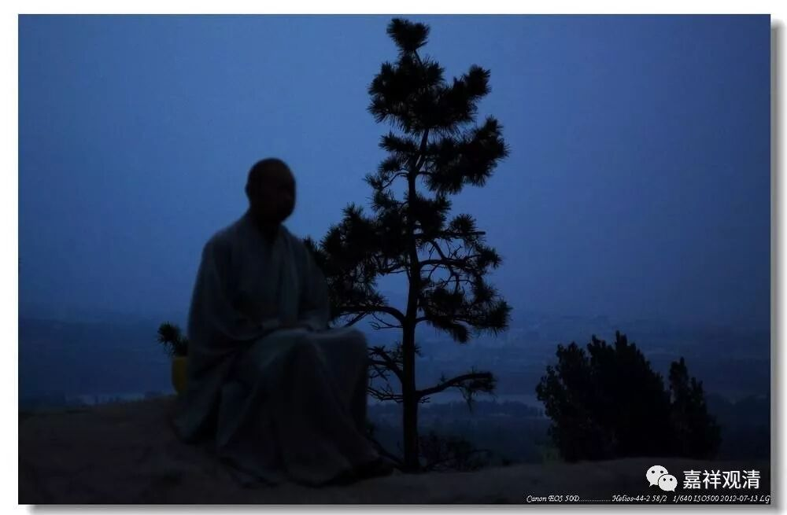

**《菩提速道》103（中）**

** “因而，在顶上修习上师天的状态中，如是思惟：**

** 清晰地观想面前有一位对自己未作任何利害的中庸有情。就其自身而言，无不是希望安乐、厌弃痛苦，故不应时而执为亲近而相饶益，时而又执为疏远而百般加害，应远离贪嗔亲疏两端，令心平等。祈求上师天加持令我能如是而行！”**

** **

这就接近于在马路上随便找一个人，或者你随便想一个人，跟你没什么关系的——中庸的有情，无关的人。

单独拿出来修的话，先想亲人比如母亲也可以的。修这个的时候是这样的，自己也可以单独想的，你也可以在训练的时候，单独把仇人想在面前也是可以的。前面我讲过的，在训练的时候可以把这些内容全部拆开，然后单独训练。

那个时候我自己在修的时候，就觉得我好像没仇人——现在的社会和以前的确不一样嘛，谁有什么苦大仇深的仇人啊！然后我就把我们班那个特别可恨的人想在面前，其实那个心情也不是很想得起来，毕竟仇并不多嘛，他也没伤过我嘛，是吧？就是人很烦，大家都看不起他……（这也很奇怪哦，真的是因缘了）

而且我们现在的心可能和以前他们真的有实际的仇人不一样，我当时就是觉得某个人曾经把我很好的荣誉抢走了，后来想想却也生不起来很强烈的嗔恨心，好像这个事情也已经过了，反正也没多少重要……现在的小资们真的有点想不起来很深怨仇的仇人，也没办法。

想亲人的话，还稍微容易点，反正教典里面都是想妈妈。想恨的对象，好像我们真的没有那种仇人，那种想一想就整个大脑都会“轰——”起来的、让我们产生非常强烈的嗔恨心的。

** “祈求上师天加持令我能如是而行！比如，若是一位住山者，先缘自己右边的邻居修习平等心，若于彼令心平等后，再缘自己左边的邻居修习，然后，同时缘二人而修，然后对于其他人众，也次第修习。”**

** **

这是一个个来修，先左边的，再右边的……就是在隔壁山头闭关的，左边的那个，还有右边的那个……

