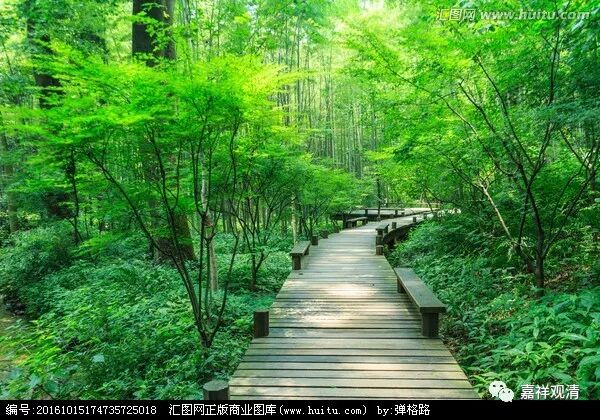

**《菩提速道》103（下）**

** “如是于彼心平等后，然后，缘一位深信情投意合的有情修习。其理者，如《月上童女请问经》中说：**

** ‘我昔曾杀汝一切，我昔亦被汝杀害，**

** 一切互相为怨杀，汝等如何起贪心！’”**

** **

哎呀！其实所有的人都这样，他也曾经利益过你，他也曾经伤害过你，所以起单纯贪心也没必要，等于是“偏”执。

** “心之所以于彼不平等，是因为贪爱的缘故。过去就是由于耽恋所爱而沉溺轮回，然而这些相知相爱的亲眷朋友等，就像相聚在同一个贸易会的商人一样，在几天的时间里，似乎相亲相爱，不久又要各奔东西，故尔一切都不应贪著。”**

** **

也像火车、飞机上认识的朋友，聊得挺欢，到目的地以后各奔东西……

所以呢，在修到这里的时候，就应该去买一本《庄子》过来看看。啊，不要执着！这样就过去了。

** “如《入行论》中说：**

** ‘因吾不了知，死时舍一切，**

** 故为亲与仇，造种种罪业，’”**

** **

死的时候啥都没了——这个确实如此啊，但我们都忘了，或者不愿意去想一想，其实我们这辈子造作这些事情都是因为自己搞不清楚我们要干什么，我们是随波逐流地度过一生，然后突然就来到了下一世，啥都没准备……

** “‘仇敌化虚无，诸亲亦烟灭，**

** 吾身必死亡，一切终归无。’”**

** **

死的时候。冤亲都带不走，身体也带不走，放不下的也最终要放下，一切的一切都没有了自主独自迎接新的一生。

** “《道次第四种转心》中说：**

** ‘此生父母子，及诸六亲众，**

** 若客聚逆旅，当令心无系！’”**

** **

就是呢，我们此生不过是一个旅游团，大家正好在一起。等到结束以后，这个旅游团也就散掉了。散掉了，就更不能执着了。如果散掉了你还执着的话，那你是更笨了。

** “若于彼令心平等后，当清晰地观想面前有一位心中确实讨厌的有情，缘彼修习平等心。于彼心不平等，则是自己的心中一向视他为异己分子而生起嗔恨。对此若心不能平等，菩提心则无从生起。”**

** **

我老师曾经和我说过一件事情，就是在常德路上的居士林，有很多能海上师和钦定上师的弟子在一起，这里面有一个人好像是他的仇人——算是仇人吧。他在修心的时候就把这个人观想在自己面前修，修了一段时间以后呢，他好像真的没那个仇恨的感觉了。然后，大家都在居士林碰到的时候，他就对那个人打了个招呼：“你好。”而且是很真心地微笑。结果对方也对他说：“你好。”这样一来二去呢，又变成好朋友了。

