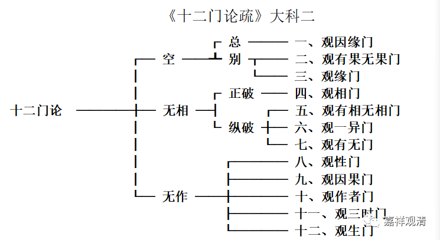

**二、吉藏对《十二门论》的第二种科判：**

** “三解脱门”乙版**

同一卷，还是依“三解脱门”展开，《十二门论疏》又出现了一种科判，

《十二门论疏》卷一：

“宜就三空分之：初三门明於‘空门’；次四门明於‘无相门’；後五门明‘无作门’。论文实有此意。”

《十二门论疏》卷四《观相门第四》：

“此下四品捡相无从，名‘无相门’……

问：何以知此下四品明‘无相门’？

答：……故知是‘无相门’也。”

依上所说，则，“空门”分三（与第一说相同）：观因缘门、观有果无果门、观缘门；

属“无相门”有四（比第一说少“观性门”与“观因果门”二）：观相门、观有相无相门、观一异门、观有无门；

属“无作门”有五（比第一说多“观性门”与“观因果门”二）：观性门、观因果门、观作者门、观三时门、观生门。

第二种科判“‘观相门’分四”的说法在《十二门论疏》卷四《观相门第四》给了三种解释：

“问：何以知此下四品明无相门。

答：文云。有为及无为，二法俱无相，则知通破一切诸相，故知是无相门也。

上三门破所相，开为总别：初门为总，二门为别。

今四门破相亦二：初门正破，后三门纵破。初门正破者，明为无为一切相空。次门纵之，更开二关往责，为有为无。若本有相则不须相。若本无相则无法可相。次门更复纵之。必言有相可相者一异求之应得。一异求既无踪。不应言有。第三门更复踪有能相。就有无求之又不可得。故三门名为纵破。

又四门即为四意。初门破为无为。正破标相。次门破为无为体相。第三门就一异相双破标体二相。第四门重责标相。

又第一门破通相。第二门破别相。第三门合破通别二相。第四门重破通相。此门称通相者。以三相通为诸法作相，故名通相。

今此品求三相无踪。故云观相门。”

以三种解释证明自《观相品》以下之四品属“无相门”：一、依正破、纵破有四；二、依“四意”为四；三、依“通别”为四。

今依正破纵破之四品（“四意”及“通别”二说，即此四品不另分科），制表二如下。

《十二门论疏》大科二

**    **

**
**

《十二门论疏》的正文中，没有为第一说“‘无相门’分六”做出任何文字上的单独解释。大致可以理解为，对“无相门”，吉藏总的倾向是分四而不是分六，如第二说。

但在《十二门论疏》的正文中，第十门“观作者门”又明确说“无作门”有三（如第一说）。《观作者门第十》：“上明二门讫，今第三，竟论，释‘无作门’。”全疏的正文解释中没有出现“无作门”分五之说（如第二说）。若有，当在《观性门第八》或《观生门第十二》中，但都没有找到这样的文字。这又可以理解为，吉藏对“无作门”更倾向于分三而非分五，如第一说。

从《十二门论》本身的结构来说，吉藏在《十二门论疏》正文当中的主张比较合理，即：“空门”有三：观因缘门、观有果无果门、观缘门；“无相门”有四：观相门、观有相无相门、观一异门、观有无门；“无作门”有三：观作者门、观三时门、观生门。

但这样就出现一个尴尬的情况——“十二门”中间的第八、第九门（“观性门”与“观因果门”）被空出来了，但全文的科判不能缺漏两个章节，于是，只能把他们勉强地或者前置于“无相门”，或者后置于“无作门”了。这样看来，以三解脱门来作为《十二门论》的总的科判不是很贴切。

