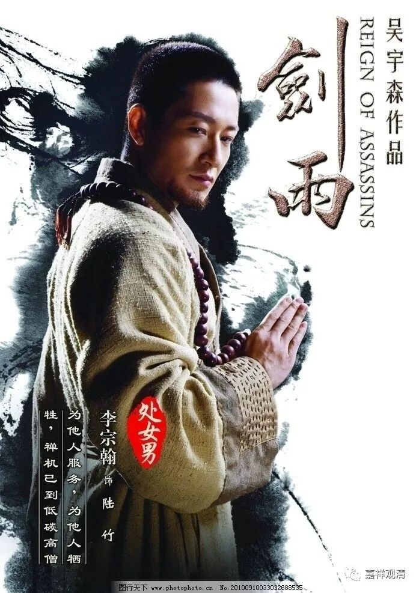
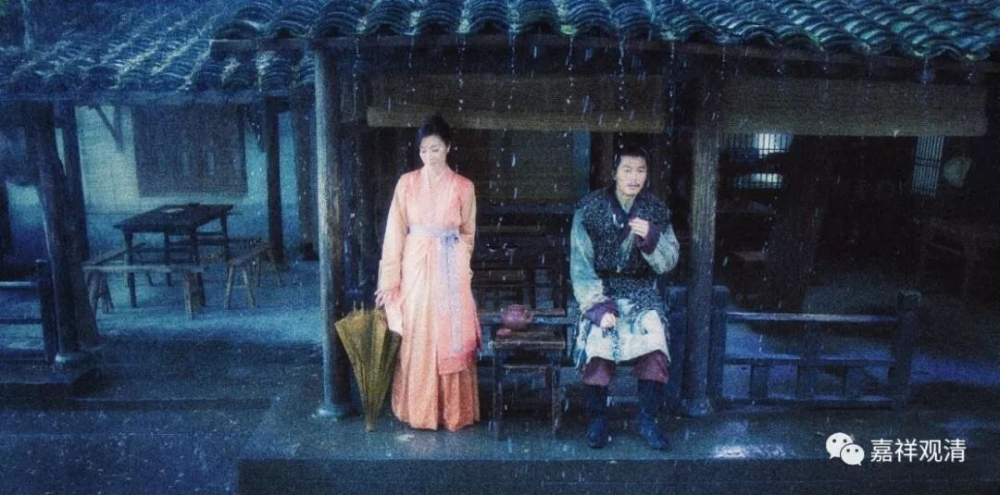
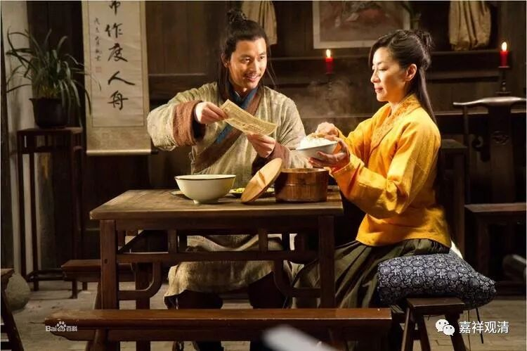
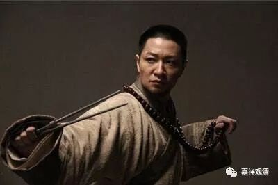

**《菩提速道》104（中）**

我又要讲电影了哦。这部电影叫《剑雨》，是我在某师父生病期间看的。男一号女一号，这两个人本身是因为恨在一起的，只是杨紫琼扮演的那位女主角是不知道的，而那位男主角是知道的。他们虽然是因为恨在一起的，可是到最后还是会有正面的想法——为了对方好。（心理学里有个说法，叫行为改变态度。）

电影里面的那个和尚——陆竹，死得太冤了！看得人眼泪都掉下来了。这个和尚就像菩萨一样，把自己的命丢了，只为了点化对方一下，而且那么好的功夫就这样没了——其实……你先教完我再走呢。这个和尚真的是大乘行者啊，不得了！他用自己的生命去点化对方，让对方不再成为杀人的魔头。这种精神恐怕只有出现在佛教里，至少我在佛教当中看到类似的故事有很多。大概编剧也是因此才一定要把这个角色塑造成一个和尚，因为这样的人若是在普通人当中真是太难得了。

（海报上说：低碳高僧，为他人服务，禅机已到，为他人牺牲）

有人说，两个人在一起，就老是想着为对方好，恐怕很难。但的确这样的心不容易生起，但是不代表不能生起啊！主要是我们的心太坏了。前两天我不是一直在讲的吗？这个方面对于知识分子来说非常困难，因为他心里想的太多。相对来说，上智和下愚都比较容易。我们的毛主席早就说过了：“最难改造的就是知识分子。”我越来越觉得他讲的有道理。

有些人呢，还带着不愿意被改造的心——他们是真的不愿意被改造，所以他们很抗拒地去做这些事情、不愿意去反省。而那些真正改造自己的人，可能放到现在会被说成是“投降派”，但他们是真心投入了改造自己的运动当中。当时整个国家，包括整个世界的思潮都比较左，他们真的觉得自己这种小资产阶级的情调或者态度是不对的，真的是在反省。不是一个人，是一个社会思潮了……

其实，假如是一种不带着时代感的这样的改造，真的很好啊！如果不去看时代的背景，毛泽东说的“知识分子要联系群众，要走到群众当中去”的态度真的是非常好啊！因为他看到当时的知识分子——小资产阶级，他们有一些很明显的缺点：一个是自私，一个是高傲，还有脱离群众等等。于是毛泽东就号召他们要“走到群众当中去”，所以就出现“上山下乡”等等。所以我们这些都应该去上山下乡，到山上到地里走走。

