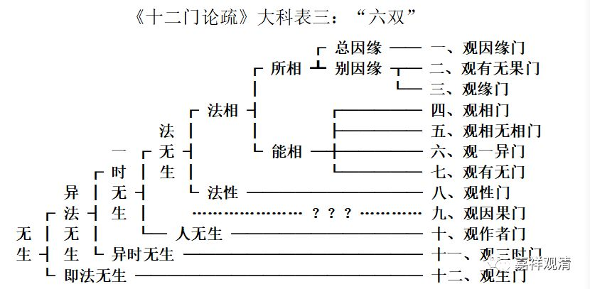

**四、吉藏对《十二门论》的第三种科判**

** “六双”**

下面再看吉藏为《十二门论》做的第三种科判，同样出自《十二门论疏》卷上的玄义部分。《十二门论疏》卷一：

“二者，此论既明诸法实相，为令众生悟无生忍，宜就‘无生’分之。可为六双：

初十一门破异法生不得，最後一门求即法生无从。即法、异法生不可得，则一切无生，令众生悟无生忍。此一双也。

就异法中又二：初十门明前因後果，及因果一时生义无从，第十一门明前果後因亦不可得，三时无生，则生义尽矣。此第二双也。

初又二：九门明法无生，第十门明人无生，人法无生，谓第三双也。

初又二：初八门求一切法相不可得，次一门捡诸法性义无从，即内性、外相一切空，为第四双也。

初又二：前三门求所相法无从，次四门捡能相不可得，则能相、所相俱空，第五双也。

前又二：初门总求因缘生不可得，次两门别求因缘生。”

若制作成标准科判形式，当如下：

此论明诸法无生。此中分二：甲一、异法无生；甲二、即法无生；

初又分二：乙一、一时无生；乙二、异时无生；

初又分二：丙一、法无生；丙二、人无生；

初又分二：丁一、法相无生；丁二、法性无生；

初又分二：戊一、所相无生；戊二、能相无生：此中有四；

初又分二：己一：总叙因缘无生；己二、别叙因缘无生：此中有二。

依此说，作表三：

《十二门论疏》大科表三：“六双”

此中第四双部分有两个问题：

1，《疏》云：“** 初八门**求一切法相不可得，次一门捡诸法性义无从”，但第八门为“观性门”，故此处实当作“** 初七门**求一切法相不可得，次一门捡诸法性义无从”。如《十二门论疏》卷五《观性门第八》：

“自上四门捡相无踪，今此一品观性非有。”

2，若依上改作“初七门……次一门……”，则科判缺第九之“观因果门”——表里的虚线部分很刺眼。

……

