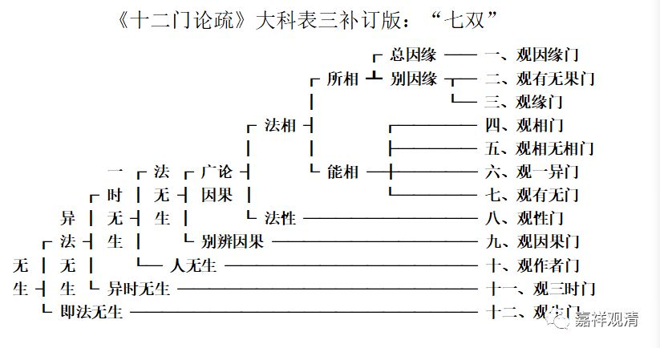

**吉藏《十二门论》科判之三**

** ——“七双”**

其实，这里《十二门论疏》应该是抄漏了“观因果门第九”，也就是在第三双和第四双之间，还有一“双”。好在《观因果门第九》提到了这漏掉的“一双”：《十二门论疏》卷九：

“问：上来已明因果空竟，今何故复说？

答曰：自上八门广破从因生果义，复有计无因自然有果。此三一病犹未除之，是故今品次破之也。

问：若尔，应言破无因有果门，云何言破因果耶？

答：论主欲对破破无因有果故。此品双破从因生果及无因有果，故言观因果。夫论因果不出斯二，斯二既无，则因果便空。又因果难明，上已广论，今次略辨，故有此门来。又有种种观门，今作因果观门以悟入实相，故有此门来也。又上门破因果便备。”

按《观因果门第九》的疏文所说，当作“初八门广论因果，第九门别辨因果”或“初八门破从因生果，此一门总破因果（从因生果及无因有果）”。

也就是说，如果按第三种科判，依《观因果门第九》这里的疏文补足，在第三双和第四双之间，当补上一“双”，作“七双”而不是“六双”。

下面，依《疏》文补足的“七双”，对《十二门论疏》的第三个科判做一下补订——

再依标准科判形式，作如下科判：

此论明诸法无生。此中分二：甲一、异法无生；甲二、即法无生；

初又分二：乙一、一时无生；乙二、异时无生；

初又分二：丙一、法无生；丙二、人无生；

初又分二：丁一、广论因果无生；丁二、别辨因果无生；

初又分二：戊一、法相无生；戊二、法性无生；

初又分二：己一、所相无生；己二、能相无生：此中有四；

初又分二：庚一：总叙因缘无生；庚二、别叙因缘无生：此中有二。

制表如下：

《十二门论疏》大科表三补订版：“七双”

补足“七双”以后，我们发现，吉藏的这个科判是完美的。

