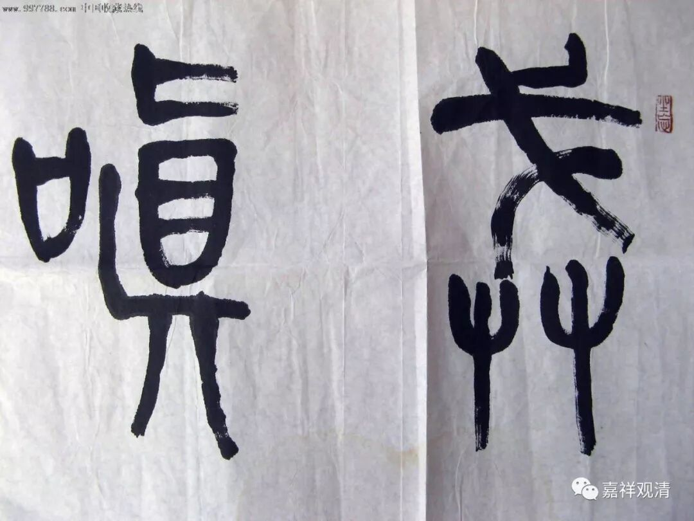

**《菩提速道》105（下）**

** “‘因此，为什么要生起嗔恚呢？’”**

** **

不生气，没有嗔恚心** ，**这一点真的是很好，但是真的是很难做到，我也很能够理解。

其实对方——嗔恨的境，是刹那刹那在变化的，你把握不住的。你还以为他是昨天的那个人，你想生起嗔恚，结果他已经变了。你刚准备对他发火，他已经展露了一个很真诚的笑容。

有人问到过，就是仅仅是一刹那发火的情况，虽然那一刹那他已经犯了过失，产生了嗔恨，但是他很快又自我觉察到了，就不再嗔恨。但是，之前那个嗔恨其实已经产生了，所以比较难的就是要克服最初一刹那的那个嗔恚。这是一定要依靠修禅定的，就是我们前面所讲的，你的正知力一定要增强。

比如说，禅定修到后来就是这么个情况：当你的这个定快要摇动的时候，你的心就已经有感觉了，在这个时候你就已经能够开始进行对治了，这个是在七住心的时候吧？就是你发觉自己的心马上就要起来，要开始摇动了，那你就立即用相对应的法来进行对治。

在你平时的生活当中也是一样，如果你能够保持非常好的正念正知，那么，这个嗔恨心快要生起来的时候——已经有点烟先冒出来了，而火还没冒出来的时候，你就想办法把它解决了，对吧？比如说，你看到那个有仇恨的人要过来了，赶快记起自己的对治法……

** “以此遮止嗔恚而修习平等心。”**

** **

对方的境是在不断变化的，你不太容易把握的。通常，我们的反应还是会比境的变化要慢一点。大的方面说呢，他以前也做过我的亲人，也对我有恩，这一点并不因为之后有怨就被抵消……

** “于彼若令心平等后，观想面前有一位像母亲一样至爱的有情和一位像仇敌一样无比憎恶的有情，就这两位方面而言，同样地希望安乐、厌离痛苦。就自己方面而言，如今执为至爱的，从无始轮回以来，也曾数不胜数地作过自己的首敌；如今执为仇敌的，从无始轮回以来，也曾数不胜数地作过自己的母亲，对自己慈爱呵护。因此，应该对谁爱，又应该对谁恨呢？所以我应远离亲疏贪嗔，令心平等。惟愿上师天加持令我能如是而行！”**

** **

所以呢，我就应该如这里说的这么做。

不过呢，你心里的那个“知识分子”就开始想了：“我只管现在。他对我好，我当然应该要对他好一点；他对我不好，我当然对他不好一点。至于以前的事情，以后再说。”或者继续用数学来推理：“在这一世以前，他们对我的贪和嗔都是无限的，所以也是一样多的，那么，今天更近，现在他对我不好，按现在的算！”这个背景我们在前面已经讲过了，就是从无穷的角度来考虑嘛。数学上从两个方面去考虑都是可以的，但从修行角度看，你肯定要从至少能够对你的善心生起比较容易的那个方面去考虑吧，因为我们在这里是希望自己生起善心，生起好的心嘛。

我们要帮正确的修行法相找理由，而不要为错误找借口。

