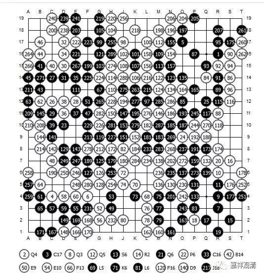
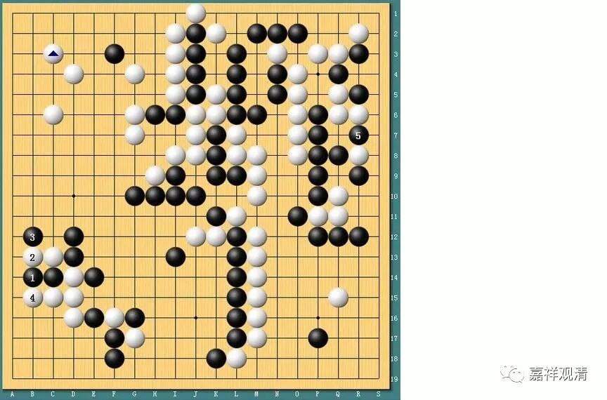

**《菩提速道》讲记106（上）**

就像这里第五世班禅大师写的这么一段，我就去相信他了。即使我暂时不能完全理解，我也先选择相信他的话。在这种情况下，再去思维的话，可能就会找到里面真正的理路、真正的办法。

围棋国手彭荃经常提起他比赛时的一些想法。比如说他对手是一位世界冠军，那你在下棋的时候，就不能按照正常的棋路下，因为那种棋一定是冠军选手一眼就看到的，他敢这样下，那一定是对他有利，你要是顺着他的思路走的话，他想赢棋，那还有你的机会吗？他一定是看到对他有利才这么落子的。所以你必须换一个想法，那个“显而易见的点”连算都不用去算了，算也是浪费时间。

（这两张都是人机大战的棋谱）

这里也是，顶级佛门大师的指导，一定是他看了觉得这样做那样做对你有利，如果你暂时一眼还看不明白的话，不妨先接受，先相信，实践下去，慢慢“行为影响心理”，好结果也会来的。

我们昨天举了两个例子，都是美国法律方面的案例。假如这件事离你比较远，或者你并不是这个案子的核心人物，或者也没有人来问你应该怎么判的时候，你肯定什么也不关心的，因为离你比较远。等到你介入这桩讨论以后呢，你就觉得“如果你放弃沉默……”的这一段当中，缄默权的有无、强调与否是一件很重要的事情。你觉得这个事（缄默权）是应该可以（有特殊的原因能够）被击破的，那么在你这样的观点的背景下，你就会对这件事情进行一种反思，然后才会对这个事情向更好的方面发展产生动力。

负面的情况也是一样。比如说昨天讲的那个关于针灸的负面的案例，也是一样的情况。如果你是带着那种同情的，你就会想：“在这个方面，我们以后应该怎么办？”比如说，那个法官本身是有同情心的，他就会思考：“我今天应该怎么判，才会对将来好一点？但是呢，我又不能违背当前的法律，因为他这样的行为可能会造成另外一些恶果……”两方面的制衡确实是有好处的。假如法官当时不判他无证行医，那么就会有其他人平时就敢无证行医了嘛。所以最后法官的判决就是：罚一块钱，蹲一天监狱。最后是这样判的。

对于一个整体事件，你有这样一个想法，然后又有一些相关的质疑——那很好，你就把这个事情好好地想一想。比如说现在这里，你是倾向于班禅大师的观点的，你就从他给你的这个答案的方面去思考，再看看你觉得他这里面似乎有些漏洞（？），最后看看你能不能帮他把这个漏洞（？）补充、解释得很圆满——这就是你聪明的地方嘛。你能圆出来，你就很聪明嘛。或者解释完以后你发现，原先是你没有理解，这个你以为的“漏洞”根本不存在，只是当初的一个误解……这个时候，你可以想像班禅大师在你面前对你熙怡微笑。

