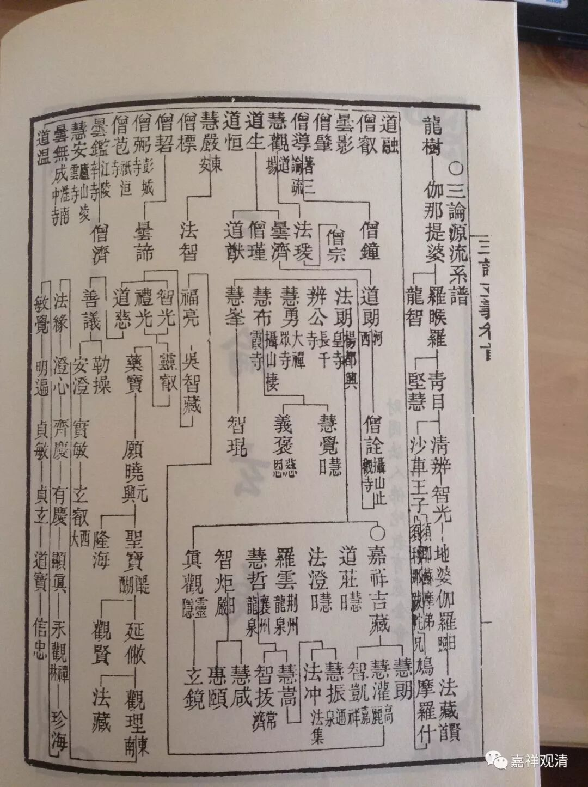

**三论宗传承诸说**

**
**

** （一）**

关于三论的源流谱系、师资传承，一直以来说法很多，因为讲课提到，正可以在这里略略整理一下，算是课堂的一个整理补充（以下诸说暂不分先后，略加评说）：

刘常净先生在《三论宗纲要》中说：

“三论宗导源于释迦、文殊，创始于龙树、提婆、传译于罗什、僧肇，弘通于僧朗、僧诠，大成于法朗、吉藏。它是中国佛教较早的一个宗派。兹遵循通常共识，立此宗十二祖：一文殊，二龙树，三提婆，四罗睺罗多，五青目，六须利耶苏摩，七鸠摩罗什，八僧肇，九僧朗，十僧诠，十一法朗，十二吉藏。”

按：僧肇生卒为公元384年-公元414年，一说公元384年-公元424年，僧朗则活跃于公元512年前后，此二人应该并无直接师承关系，故，以僧肇为“八祖”，与“九祖”僧朗之间，不是师承关系，大致可以说，罗什僧团下，以僧肇为最上首；摄山传承，以僧朗为最初，之间传承不明，甚至僧朗未必是僧肇传承下的那一系中观师。

日本凝然在其《八宗纲要》等书中提出三论宗在中国的传承是：

……罗什——道生——昙济——道朗——僧诠——法朗——吉藏……

按：望月信亨《佛教大辞典》亦同此说。然此说经考证，乃凝然误摄山僧朗为河西道朗，以河西道朗承昙济，故能上溯至罗什。则罗什至僧朗之间，仍为迷雾。

羽溪了谛谓三论宗此一段传承为：

……罗什——僧嵩——僧渊——法度——僧朗——僧诠——法朗——吉藏……

按：僧朗之师法度，元未必与三论相关，而僧渊之徒法度，即昙度，亦非摄山之法度，此则二“法度”误为一。

……

