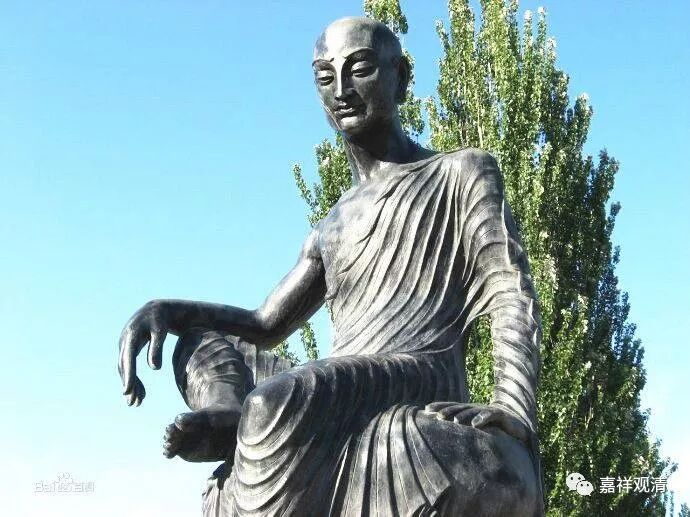
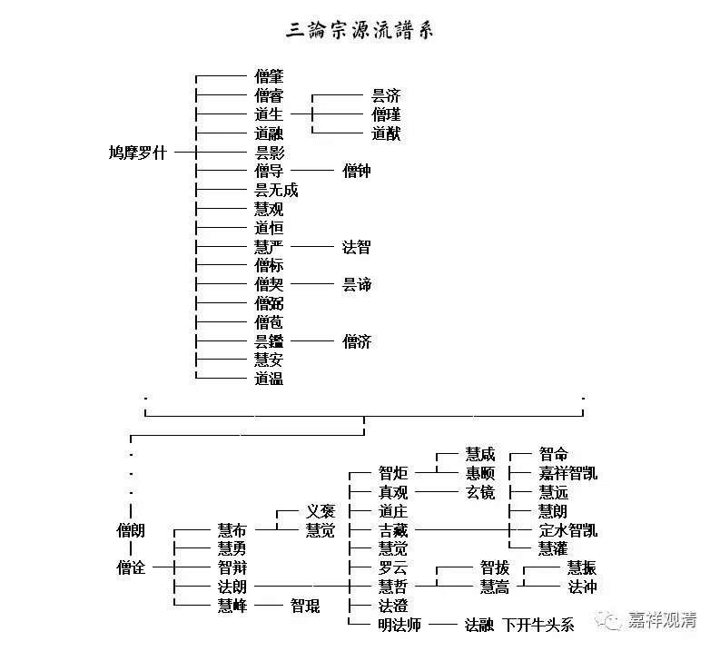

**三论师资图（二）**

** 《三论宗纲要》的作者前田慧云也举出三论宗在中国的传承源流，即：**

** 罗什——僧肇、道融——道朗——僧诠——法朗——吉藏……**

** **

** 此说以僧肇、道融承罗什，以道朗承之。但是，僧肇和道朗之间未见有传承关系，故僧肇全无入谱之必要。再者，道融虽讲述《中观论》，但仍无与道朗之间的传承记载。且，河西道朗与摄山僧朗故非一人，上文已提及。**

** **

** 所以从今天的认识来看，罗什门下弟子众多，讲述中观并撰有著述者亦不乏其人，此后关河一代多有传承罗什之中观学者，但此时及稍后的中国北方及中原一带战乱频仍，中观师资传承记载缺如……战乱累起、灭佛数行，故诸明僧高士在此百年间陆续南下，将中观学引入长江流域，沿长江一带名山、都市散开，其中庐山、南京、扬州、虎丘皆有中观师驻锡，其中最有名的便是摄山的僧团教众。**

** **

** 摄山师资传承是有序、有文字可查的，以上各家几乎没有异议（最多也就体现在法度是不是能被列入了），若以吉藏为正统，则吉藏之师承为：……（法度——）僧朗——僧诠——法朗——吉藏，这是一致共许的。**

** **

** 如果不是非要像中国历代的皇上们那样认（或者冒认）族谱的话，我们可以大而化之的说，摄山的三论传承和关河旧说有关，但并不确定实际是哪一支的血脉……**

** **

** 我们做一个大致的源流图如下，未知之处用虚线表示：**

** **

** **

** 按这个态度，刘常净先生给出的三论祖师传承表里，我们也把罗什至道朗之间，以虚线连接，就可以大概说不错了……**

