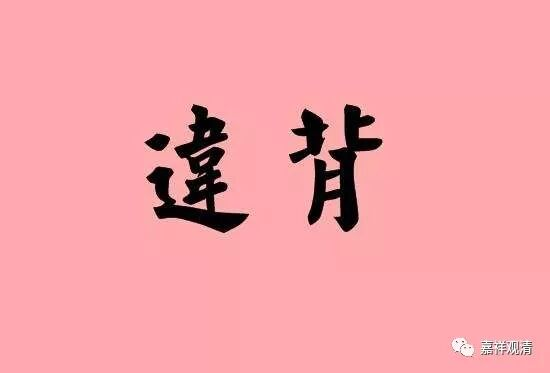

**
**

** 课堂补充：自性与缘起**

关于无自性和缘起的问题，《缘起赞》里有一个颂子简单明了——

“自性无作、待，  缘起有待、作，

此二于一事，    何能不违、顺？”

“自性”则必然是无作（非造作）、无待（不观待于他法而有）的，而“缘起”则必然是观待而有、必是造作的。“自性”与“缘起”这两个怎么可能在一个事情上同时成立呢？自性和缘起，他们怎么能不相违而符顺呢？不可能啊！

“自性”的意思是无作，非造作，如果是造作出来的就不是自性了，它就是有能造作的人，所造作来的物；“自性”是无待的，是不观待于其它的存在而存在的。如印度宗教认为湿婆是永恒的、不观待他的。

“缘起”一定是有待、有作的，依靠因缘而建立，有依靠，就是有待，建立、成立，就是造作出来的。

那么，“自性”“缘起”这两个在一件事情上，怎么能够不相违的随顺呢？这二者完全是相违的。无作和有作，无待和有待，肯定是相违的！佛教内部中观应成以外的派别欲同时成立“缘起”和“有自性”，一定是不能成立的，“缘起”和“有自性”怎么可以不相违而且能够相顺呢？这根本做不到啊！

在中观宗看起来，这个问题简单得很，但其他部派却完全不能理解。这是什么原因呢？

