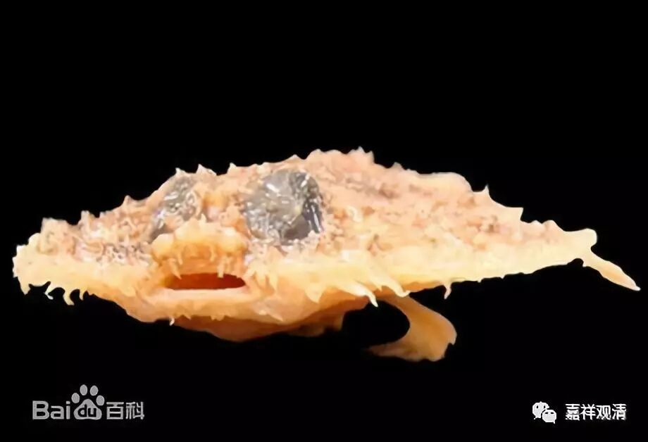
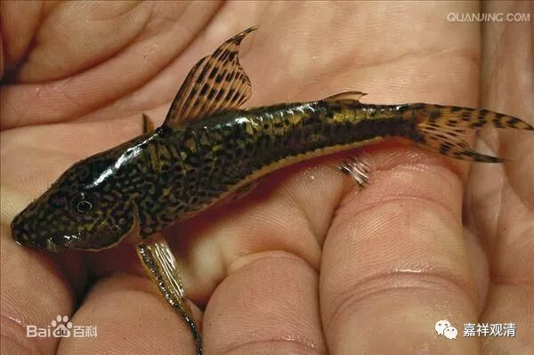

**《菩提速道》讲记107（上）**

** “而且都曾不可数计地受生过；没有一类这样有情的身体未曾受取过，而且都曾不可数计地受取过；没有一位这样的有情未曾作过我的母亲，而且都曾不可数计地作过；也没有一位有情不曾在人中作过我的母亲，而且每一位有情都曾不可数计地作过，未来还将会作。因此，这些有情都是深恩哺育过我的母亲！如是思惟。”**

** **

新物种

从现代科学的角度来看，这里的“** 没有一类这样有情的身体未曾受取过”**大概没法说。至少这个“不可数计”，我觉得我这种学医、学生物的恐怕就不能承认，因为有基因突变出现的新的有情种类，刚出来的生物种类，你总不能说我已经无数次的做过吧，对吧？（呵呵，老作孽了。知识分子真反动！）有些人呢，比如我，不太能接受知母、念恩、报恩里面的这种逻辑关系，为了这些人呢，佛也没办法，就针对这些人再讲后面一种自他相换。我们真是太作了！还好有自他相换教授，我觉得那个比较容易说服我……不过做不到啊，太难了……

** “若念：‘那么，有情的数目无量，一切有情不会都成为自己的母亲。’”**

** **

其实这个问题也是一样，他的讲法是针对三百年前，当时座下的这些人，这样来证明就完全够了。针对今天我们这样的人，他这样的证明是完全不够的，太粗糙了。

** “应这样思考：有情无数，并不能成立就不是我的母亲。有情无数，同样，我的受生也无数，因而不管怎样，一切有情皆是我的母亲。”**

** **

实际上我们看起来这中间并没有完成证明。他只是说，因为有情和我的受生都是无数，然后没有证明，就说“不管怎样”，就都是我的目前了。若是金岳霖先生就会质疑：“‘不管怎样’，为什么？”

** “若心想：‘我与一切有情互不相识，因而不是我的母亲。’”**

** **

“若心想”，这是指对方的想法，是不认为“有情都做过我的母亲”的人找的一个理由。一般人就是这样的思路。

这个肯定不能承认哦，这个理由是不对的。宗：有情不是我的母亲；因：我不认识……以不认识为理由想证成他不是我娘，这个观点肯定不对，也是本文这里要批评的对象。很简单啊，有些人就是不认识亲娘啊（失忆了连自己都不认识呢，电影里都这么演……）

