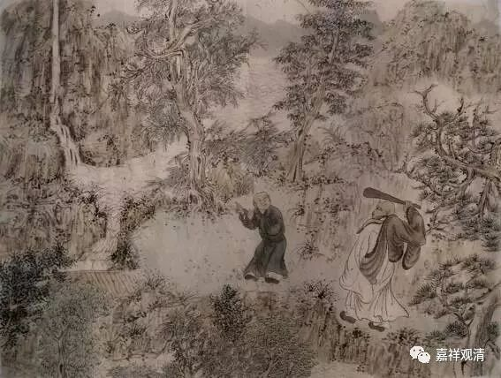

**《菩提速道》107（中）**

** “如是思惟：我和一切有情互不相识为由，并不能成立不是我的母亲。就这一生而言，母子互不相识的例子也有很多。比如莲花色比丘尼，与自己的儿子成为夫妻，与自己的女儿成为妻妾后，还是互不相识。**

** **

** 又如在前面引用的‘笞母食父肉’等文中，说有一个人的父亲死后受生为鱼，他自己吃着鱼肉。母亲死后受生为一条母狗，贪恋着鱼骨。他自己前世的凶手投生为他的儿子，也都不认识。”**

** **

那么，他应该怎样对待这只母狗和前世的凶手（仇人吧）呢？他应该怎么做呢？禅宗里面对这类事情倒是有一个做法，很多人就把它当作是一个真的事情来看待，我觉得呢，禅宗只是说了一个故事，用来解决这个问题。

禅宗的一位弟子问师父：“师父，你死了以后，下一辈子怎么来啊？”师父回答说：“我就是山下的一头水牯牛。”然后，弟子又问：“那我们怎么相见啊？”师父答：“你带着草来，就对了。”意思就是，应当以何身相见，就以何身相见，不用去想太多的。

那么，很多人就以为这是一件真实的事情，认为这个和尚是犯了什么什么戒，然后要去做水牯牛去了，就有这个故事。我觉得不是这样。我讲过很多次，中国的禅宗是受到中国传统文化的影响的，它在很多方面受到了《庄子》的影响，所以很多禅宗故事实际上都是类似于庄子里的寓言性质的东西。

这个故事是什么意思呢？就是在说死了以后，这位师父会做水牯牛，那么徒弟该怎么办呢？该如何去相见呢？师父说带一盆草来就行。就是该怎么相见，就以什么形式相见吧。应该以何身度，就以何身说法。差不多是这个意思，并不是说他真的死后要去做水牯牛。他是牛，去见的时候不就是带捧草去吗……

当然，也有人试图从正面去理解，觉得前面那种犯戒的说法不对，想把这个故事的背景给圆回来，否则禅宗的祖师怎么会去做水牯牛去呢？于是就说，投生水牯牛应该是在修禅定，禅宗不是有十牛图吗？就说他在山下做和尚，修禅定。

其实这个说法也不对。我说了，这个故事只是一个寓言，应以何身相见，就以何身相见，类似于这样的意思。否则你要怎么样呢？假如说，我哪天看大家都是我的母亲，那怎么办呢？母亲节的时候就把大家都聚在一起，父亲节的时候也聚在一起，儿童节……什么节日都聚在一起？

他在这里讲一切有情都做过自己的父母，是为了要引出后面的内容，你看他后面讲的就都知道了。所以，就像我前天讲的，你不会下棋的时候，有时候看别人前面一步棋是不是走错了，但实际上这步棋走下去了之后呢，后面两步棋就知道应该怎么走了。这里也是一样，你看着科判就能明白了，你看到后面两个科判就知道他想干嘛了。他是想把一切众生当作自己的母亲之后，再去修慈悲心的，是从这个角度来看的。所以啊，看阿尔法狗下棋能够长见识。

