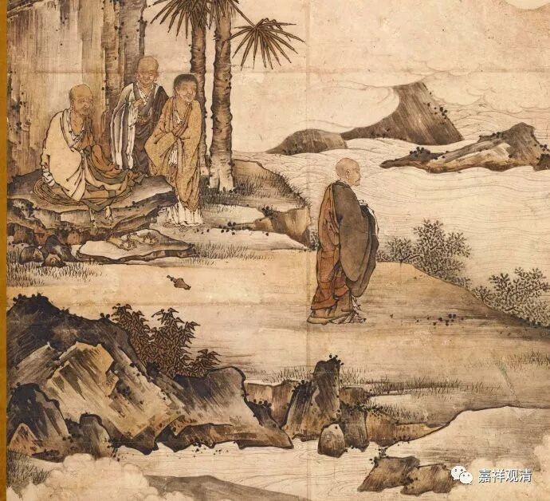

**衔一茎草来**

《曹山禅师语录》：

** 南泉病时。**

** 有人问：“和尚百年后向甚么处去？”**

** 泉曰：“我向山下檀越家，作一头水牯牛去。”**

** “某甲拟随和尚去，还得么？”**

** 泉曰：“若随我，含一茎草来。”**

南泉普愿禅师生病了。

有人问：“师父百年以后去向哪里？”

南泉普愿禅师说：“山下施主家，去做一头水牯牛咯！”

“我也想跟老和尚去，行吗？”

老和尚回答：“你要是来，别忘了衔一茎草来。”

这并不是说南泉普愿禅师堕入恶道，也不是如曹山禅师说的，“把水牯牛理解为比喻法身的白水牛（这是从《法华》三车、四车而来的比喻）”，“把衔草理解为证得无漏”……其实只是泛泛一说——水牛来见水牛，带根草不是很有礼数吗？（哈哈）大禅师曹山这是想多了！

 《沩山禅师语录》正是最好的注脚——

** 师（沩山）指水牯牛云：“道！道！”**

** 仰山取一束草来。**

** 香严取一桶水来。**

** 放牛前。**

** 牛才吃……**

沩山灵佑禅师逗他俩徒弟玩呢。

他指着水牯牛说：“说！说！！”

仰山慧寂禅师给他拔了一束草来了……

香严智闲禅师给打了桶水过来……

都放在牛前面。

牛也很配合，吃吃喝喝起来了……

（还记得这爷仨打水、奉茶的公案不？！）

        修改于