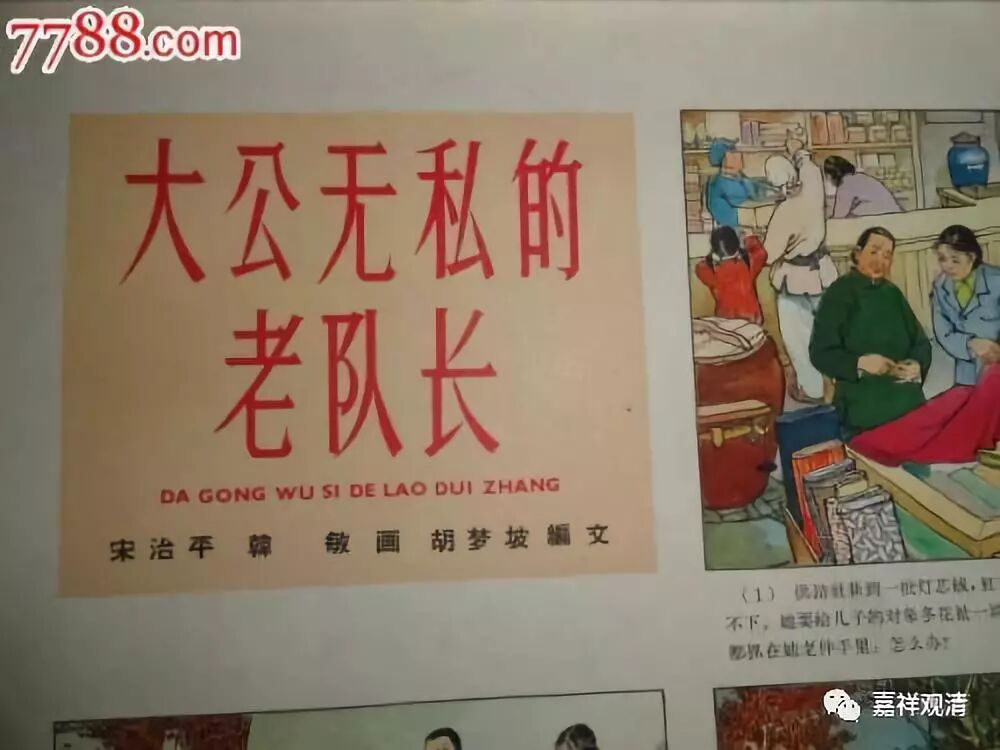

**《菩提速道》107（下）**

** “如果认为：‘假如一切有情都是过去世中的父母，既已成为过去，就不应该再是母亲。’”**

** **

一般人继续“顶嘴”：过去世的母亲，不是现在的母亲，所以不是母亲！——这个想法也不对的哦。

** “如是思惟：那么，昨天的母亲在今天已成为过去，也应当不再是母亲了。因此，昨日之母与今日之母二者，作为母亲并无差别，对自己深恩哺育也没有差别。**

** **

回怼：那昨天的母亲也不是现在的母亲，就不是你娘了吗？还是娘啊！恩情也一样啊！

** **

** 又譬如在前一年，有恩人在自己将比如被国王杀害的时候救过自己的生命，与在后一年救过自己性命的恩人，除了前、后年的差别之外，恩德并没有大小的差别。同理，我前生的母亲和今生的母亲，在是母亲方面，也没有差别，深恩呵护上也没有不同。因此，不管怎样，一切有情皆是我的母亲。”**

呃……

我觉得我还是修自他相换吧！母亲之间没有差别吗？实际上这个还是不能证明，因为A母亲和B母亲还是不一样的。这段感觉就是先搞了一个很大的范围，然后又在这个范围当中抽出一个概念叫母亲，再对母亲这个概念进行优化……算了，还是修自他相换吧！（在母亲上没有差别，但是在深恩呵护上，还是有差别的嘛……）

我不记得是祈竹仁波切还是雪歌仁波切或者哪位仁波切讲的，那个说法比较有道理，就是把母亲放在这里讲，其实是有寓意的。实际的意思是：你的每一世肯定会有一个人对你好，而且是没有附加条件的。这种人肯定有的，哪怕你这一世没有母亲，哪怕你真的是化身出现的，肯定有一个人，他对你的付出是不加任何附加条件的。那么，对于这种人，我们会发现，在绝大部分的情况下，最后你能找到的这个人就是你的母亲，或者很容易就指向你的母亲。

但实际上他想说的是，一定有这么一个人，他对你的爱或者对你的付出是没有任何附加条件的、无私的给予，或者说多半会有这样的人，或者是你这一世当中肯定有一个对你最好的人，他是不要求任何附加条件的。在这种概念当中，我们更容易找到的这个人通常是自己的母亲。

“知母”可以从这个角度来考虑，我觉得这样比较容易接受。

