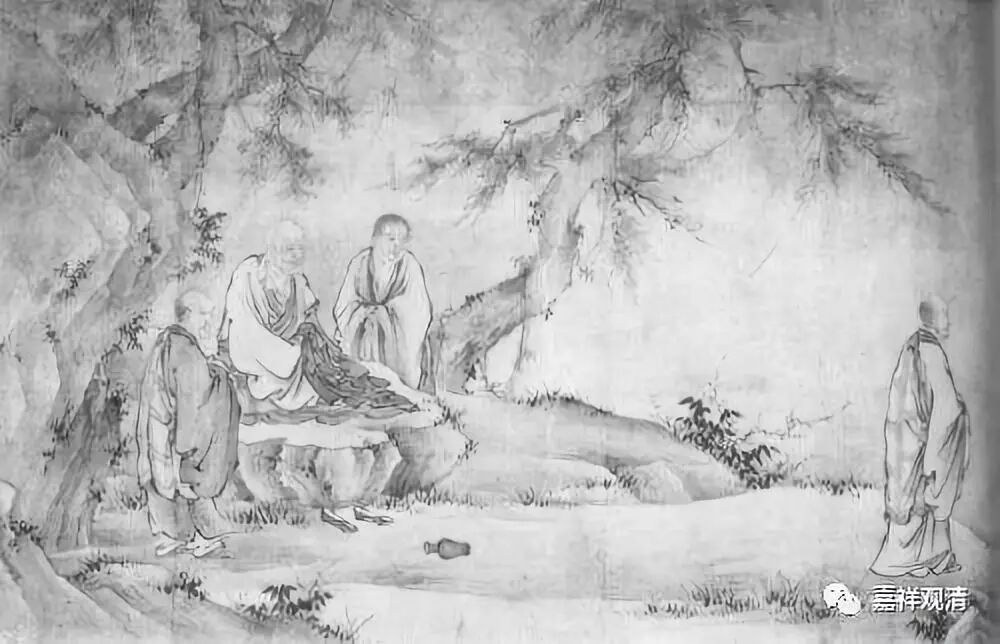
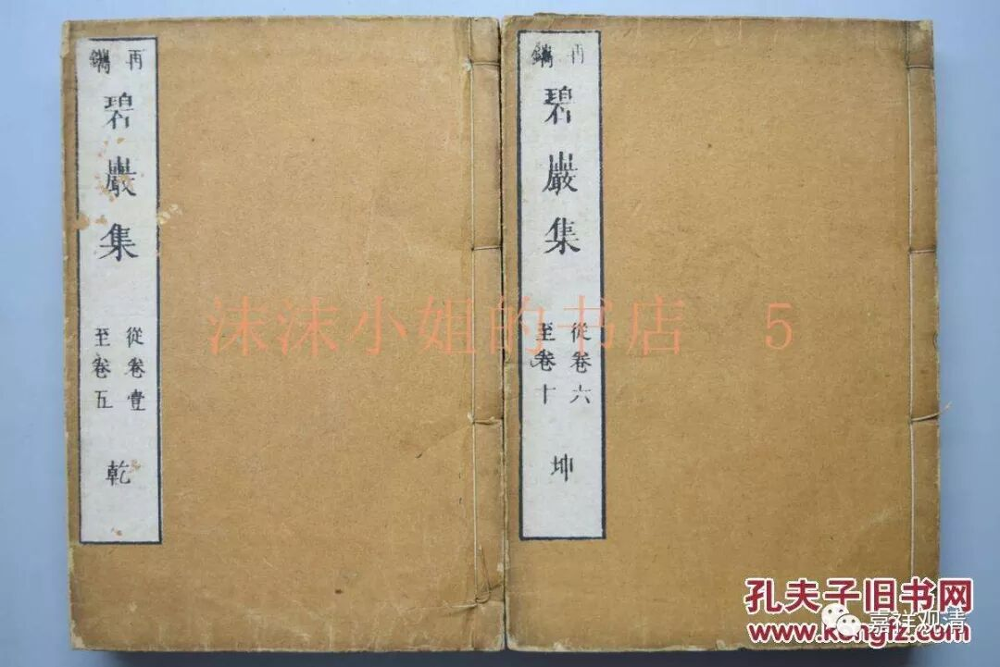
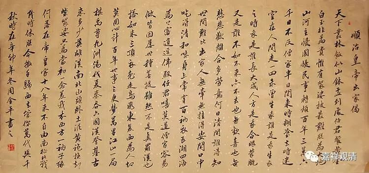
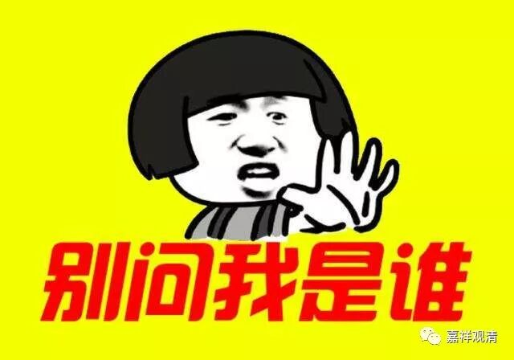
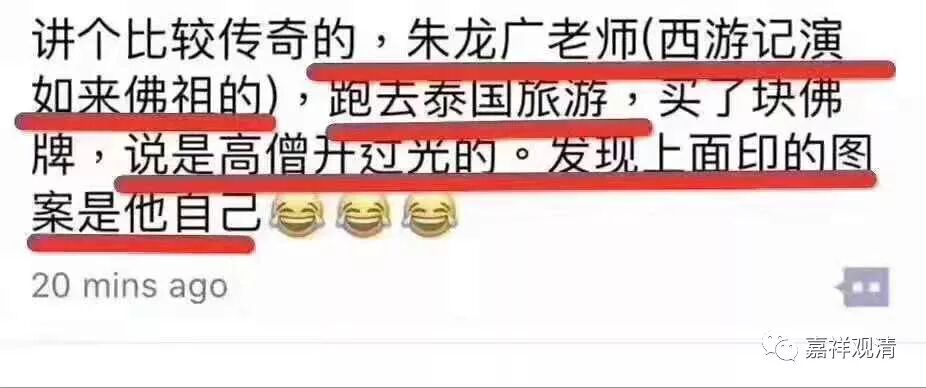
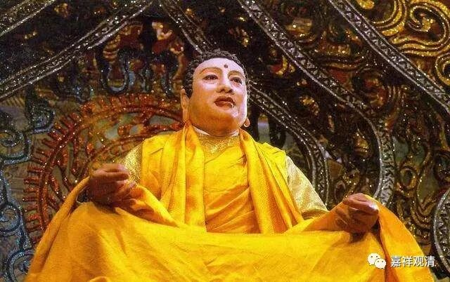

**《门外谈禅》**

** 未曾生我谁是我，生我之时我是谁……**

圆悟克勤禅师《碧岩录》：

** 沩山道：“老僧百年后，向山下檀越家，作一头水牯牛，左胁下书五字云——沩山僧某甲。且正当恁么时，唤作沩山僧即是？唤作水牯牛即是？”**

还是沩仰宗开山祖师沩山灵佑禅师的公案。

沩山灵佑禅师说：“假使老僧我百年之后，投生到山下的施主家里做一头水牯牛，左边胁下还写了五个字——‘沩山僧灵佑’！我来问你们，这个时候，该称他为‘沩山僧灵佑’呢，还是该管他叫‘水牯牛’呢？”

老和尚又在这里出考题，不知道有几个机灵的徒弟答得上来。

今天也正讲到中观破我执的部分，这里的这个公案拿来还略有点应景。可以说，佛教终极的话头不过如此——过去的我是不是我？未来的我是不是我？过去的和未来的我有什么联系？轮回的主体到底是什么？

记得高中三年级的时候，我写了一篇作文——《我》，得到老师的夸奖（自己也觉得写得很high），用到了传为顺治所作的出家偈：

** “未曾生我谁是我，生我之时我是谁？**

** 长大成人方是我，合眼朦胧又是谁？”**

我似乎还记得，那篇作文的最后一句是：

那么，我，是谁呢？

……

** “且正当恁么时，唤作沩山僧即是？唤作水牯牛即是？”**

来，同学们，道一句看！

。

。

。

。

