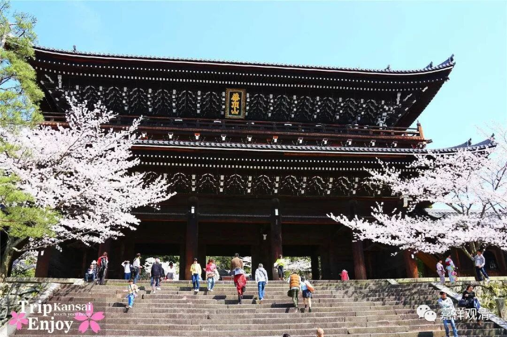
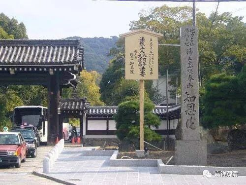

**《菩提速道》讲记108（上）**

除了母亲，其实还有其他人也在我们身边无私地给予我们帮助，比如说我们的老师，真的是，一生一世无私地给予我们帮助。医生也是，甚至还有我们的警察叔叔们也是，别老以为他们是在针对你，其实他们真的很无私，加班加成这个样子，晚上一直在外面巡逻等等。我真的觉得他们是被催眠了，才会对你这么好，要不然他凭什么呢？真的像失心疯一样，为了这几千块钱把自己的命都豁出去？

那么，在这些人当中，离你最近的就是母亲。从这个角度来看，可能更容易生起这样的心。这是谁解释的我已经忘了，就当是我自己吧，哈哈。（开玩笑啦，我的老师们解释的。）

** “（三）念恩：”**

** **

我们其实可以用“知恩”来修，是吧？就是不用“知母”，用“知恩”，然后念恩。那就不是“知母”，而是“知恩”，然后再念恩、报恩。（好了，以后菩提道次第当中菩提心的修法又多了一个“清帮传承”哈哈哈哈……。）第一条是知恩，然后再念恩，然后是报恩，然后是慈、悲，这样都可以了。（还是玩笑啦。但之前的“知母”，确实可以如前，理解为要知道有人对我无私付出的恩德……）

** 京都知恩院**

**
**

** “如此知母之后念恩之理，在顶上修习上师天的状态中，如是思惟：”**

** **

这里反复出现了上师天，是预设了大家对于仪轨已经非常熟悉了。我们也可以看第22页，“遍摄依处上师殊胜天，能仁金刚持前诚祈请”，对吧？这个时候在你脑袋上面的是什么呢？是上师能仁金刚持。他的体性是什么呢？他的体性是上师。形象是什么呢？是能仁，是释迦牟尼佛。他的心当中是什么呢？就是脑袋上释迦牟尼佛的这个样子，他的心当中是金刚持。这就是“上师能仁金刚持”。

这个时候在你脑袋上的样子，从外面看起来就是释迦牟尼佛的样子。你可以观想在释迦牟尼佛的心中是金刚持，但实际上不太容易想得起来，大致知道就可以了。这金刚持的心间还要加一个“吽”字。

