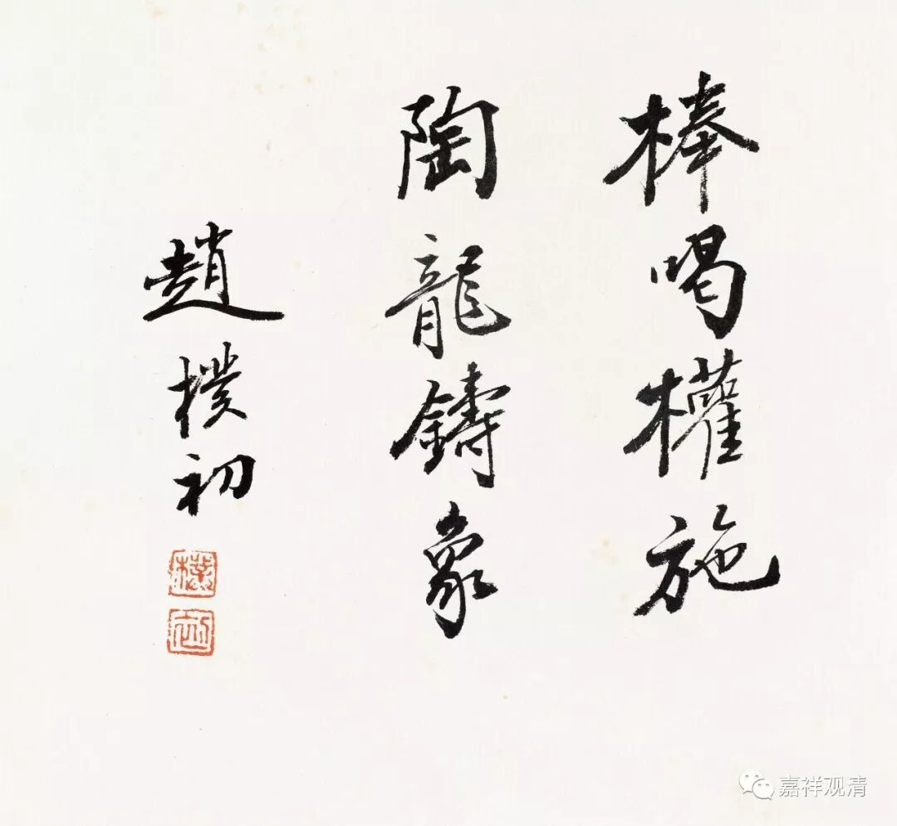

**棒喝权施，陶龙铸象**

《禅林宝训》卷三：

** ……死心住云岩，室中好怒骂。衲子皆望崖而退。**

** 方侍者曰：“夫为善知识，行佛祖之道，号令人天，当视学者如赤子。今不能施惨怛之忧，垂抚循之恩，用中和之教，奈何如仇讐，见则诟骂，岂善知识用心乎？！”**

** 死心拽拄杖趁之，曰：“尔见解如此，他日谄奉势位、苟媚权豪、贱卖佛法、欺网聋俗，定矣！予不忍，故以重言激之，安有他哉？欲其知耻，改过怀慕，不忘异日做好人耳！”**

那个时候，死心悟心禅师住在云岩山，他开法传禅，总是喜欢以怒骂来接引学人。学僧们看到害怕，不敢亲近。

这时候侍者劝到：“做善知识的，行佛陀祖师之道，为人天师范，应该视学人如婴儿一般，善加呵护。现在和尚您不施悲悯恻隐之心，不予安抚慰问之恩，不用中正和缓之教，干什么对他们像对待仇敌一样，见面就批评责骂……作为善知识怎么可以这样用心待人呢？”

死心悟心禅师抄起根棒子（我觉得应该是鞭杆）就扔了过去，他一面追着侍者跑，一边说到：“你这家伙要是这样的见识，将来必阿谀权贵、奉侍官僚、媚于豪强、贱卖佛法，去欺惘世间啊！我不忍见学僧们堕于俗务、流于凡俗，才以一些重话来激励他们，难道还有其他什么想法吗？是希望他们能在棒喝之下知耻改过、志存高远，将来不失为一个好人啊！”

今此末世，去圣时遥，肯当面说重话的师父，都是真的为你好啊！不然，得罪人好玩吗？

