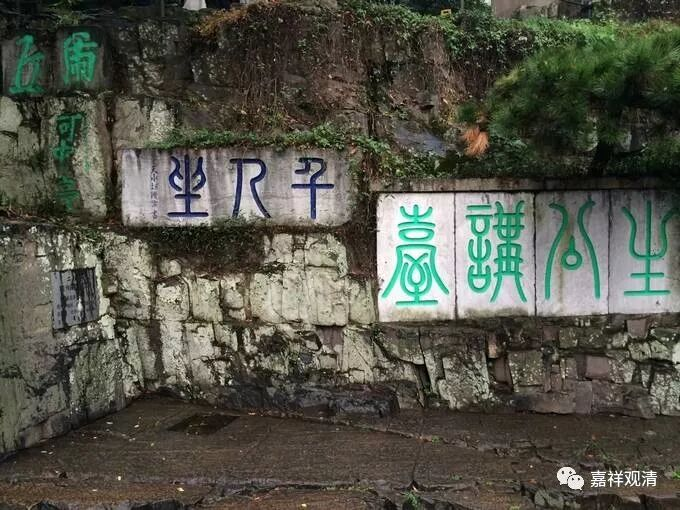
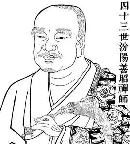
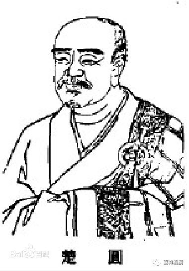
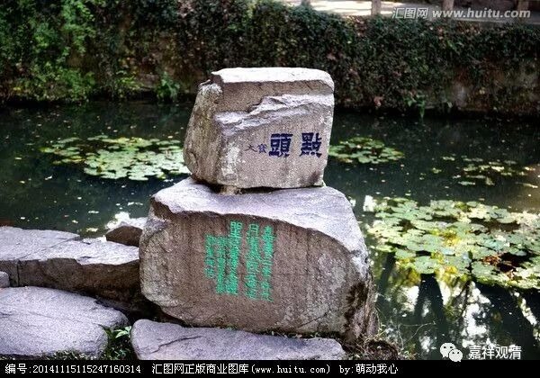

**（虎丘·生公说法台）**

《禅林宝训》卷四：

** 昔汾阳每叹像季浇漓，学者难化。**

** 慈明曰：“甚易！所患主法者不能善导耳。”**

** 汾阳曰：“古人淳诚，尚且三二十年方得成办！”**

** 慈明曰：“此非圣哲之论。善造道者，千日之功。”**

** 或谓慈明妄诞，不听。**

** 而汾地多冷，因罢夜参。有异比丘谓汾阳曰：“会中有大士六人，奈何不说法？”**

** 不三年，果有六人成道者。**

汾阳善昭禅师经常感叹时代人心，认为去圣时遥，人心不古，学者难以教化。

他的弟子石霜楚圆禅师劝他说：“不难啊，只是一般老师不能善加引导罢了。”

汾阳善昭禅师说：“哪里那么容易呦！古人纯洁精诚，尚且需要三二十年方才教得出来啊！”

石霜楚圆禅师回答到：“‘三二十年成才’并不是圣言量的授记啊！教学有方的人，三年便可教学有成了！”

大家都当石霜楚圆禅师说大话，不听他的。

汾阳在北方，冬天寒冷，所以，夜参被取消了。有异僧对汾阳善昭禅师说：“这里的大众中有六个人才，为什么停止讲法呢？”

果然，不出三年，门下相继有六人学有所成。

** （虎丘·石点头）**

清案：

善教与善学者若能啐啄同时，三年小成可期，石霜楚圆禅师所说真的是有实践支持的。其实我也觉得，若教学得法，三年时间，资质稍强的学生都是能走上路的。上路以后，学习就像下坡一样，容易多了……

曰：

生公说法，顽石点头；

善教学者，三年有成。

