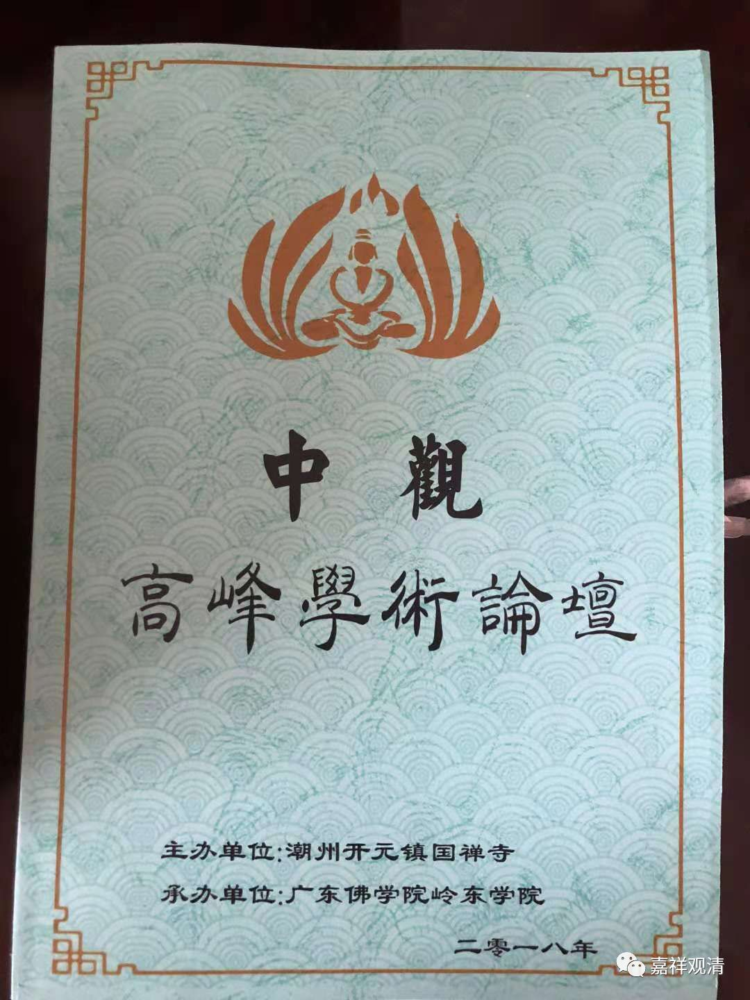
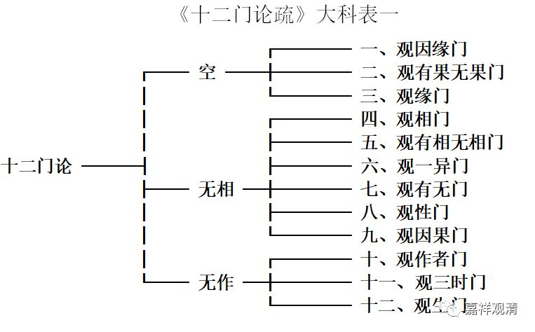
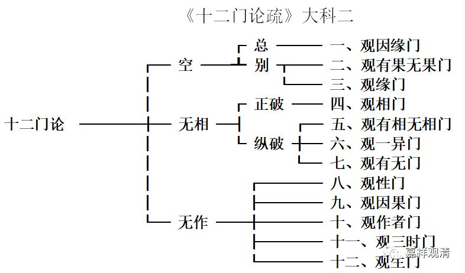
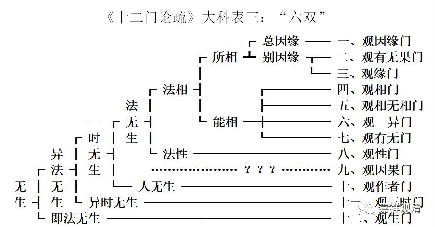
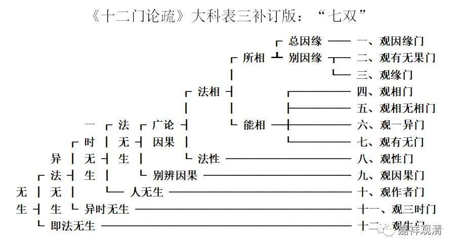

**吉藏对《十二门论》的三种科判**

【摘要】《十二门论》是龙树大师阐述中观甚深见的作品，它大致是《中观论》的略论，今仅存汉译，是中国的中观派——三论宗的重要理论依据。三论宗的集大成者吉藏大师为《十二门论》作了《疏》，在《十二门论疏》中，新三论师的代表人物吉藏对龙树之《十二门论》给出了三种科判，但都“未尽善”也。此中可见自古三论师至新三论师对《十二门论》疏释（特别是科判）的演变，可以发现吉藏对古三论师的旧说做了新的总结性的尝试。

【关键词】《十二门论》中观 龙树 吉藏

《十二门论》一卷，作者署名龙树，此书可视为为《中观论》之略论，如《十二门论序疏》云：“……明实相之轨，凡有三论：一、《无畏》之广。二、《中论》处中。三、此论之略。在言虽略，而为入道场之要故也。有诸大乘论言广难寻，斯论辞略显诣……”论有十二门，即十二品，故称《十二门论》。今仅存汉译，为姚秦三藏法师鸠摩罗什于弘始十一年（公元409年）译出。译出后便与《中论》、《百论》合称“三论”，成为中国的中观宗——三论宗的核心教典。

公元602年，隋仁寿二年，吉藏54岁时，隋文帝杨坚敕吉藏撰《净名疏》、《中论疏》和《十二门论疏》；至公元608年，隋大业四年，吉藏60岁时，撰成《中论疏》、《百论疏》、《十二门论疏》，其中《十二门论疏》应该撰成最晚。三论注疏的完成是他创立三论宗的标志。

嘉祥吉藏的《十二门论疏》对《十二门论》做了全面疏释，在解释全文的基础上，他给“十二门”做了科摄，在《疏》文的“玄义”部分，我们看到他给出了三种科判，这三种科判都是吉藏个人总结的结果。

** 一、吉藏对《十二门论》的第一种科判**

** “三解脱门”甲版**

先来看第一种科判。此出《十二门论疏》卷一《观因缘门第一》：

“……门虽十二，不出三空：初有三门，求有法不得，名为‘空门’；次有六门，求相无踪，谓‘无相门’；後有三门，求起作无踪，即‘无作门’……”

这里的“三空”，是指的“三解脱门”：空、无相、无作。

此一科判中，属“空门”者有三：观因缘门、观有果无果门、观缘门；

属“无相门”有六：观相门、观有相无相门、观一异门、观有无门、观性门、观因果门；

属“无作门”有三：观作者门、观三时门、观生门。

这一科判在后面的疏释中也得到印证，如《十二门论疏》卷四《观相门第四》：

“此下……名‘无相门’……”

这里说第四品以下开始“无相门”，则上三品属“空门”。

又，《十二门论疏》卷六《观作者门第十》：

“上明二门讫，今第三，竟论，释‘无作门’。”

三门有浅深，无有浅深义。

无浅深者，一一门无病不破，无理不显，故门初门后，皆唱一切法空。

有浅深者，‘空门’破有，‘无相门’破空。此二门非有非空，即中道境、中道观。今门（无作门）明息观。故三门空有并亡，缘观俱寂，所以论明三门也。”

这里说第十门《观作者门第十》以下到论终（《观生门第十二》）为“无作门”，则“无作门”有三。

把第一种科判做成表，如下：

《十二门论疏》大科表一

这一科判看起来非常简洁。

** 二、吉藏对《十二门论》的第二种科判：**

** “三解脱门”乙版**

同一卷，还是依“三解脱门”展开，《十二门论疏》又出现了一种科判，

《十二门论疏》卷一：

“宜就三空分之：初三门明於‘空门’；次四门明於‘无相门’；後五门明‘无作门’。论文实有此意。”

《十二门论疏》卷四《观相门第四》：

“此下四品捡相无从，名‘无相门’……

问：何以知此下四品明‘无相门’？

答：……故知是‘无相门’也。”

依上所说，则，“空门”分三（与第一说相同）：观因缘门、观有果无果门、观缘门；

属“无相门”有四（比第一说少“观性门”与“观因果门”二）：观相门、观有相无相门、观一异门、观有无门；

属“无作门”有五（比第一说多“观性门”与“观因果门”二）：观性门、观因果门、观作者门、观三时门、观生门。

第二种科判“‘观相门’分四”的说法在《十二门论疏》卷四《观相门第四》给了三种解释：

“问：何以知此下四品明无相门。

答：文云。有为及无为，二法俱无相，则知通破一切诸相，故知是无相门也。

上三门破所相，开为总别：初门为总，二门为别。

今四门破相亦二：初门正破，后三门纵破。初门正破者，明为无为一切相空。次门纵之，更开二关往责，为有为无。若本有相则不须相。若本无相则无法可相。次门更复纵之。必言有相可相者一异求之应得。一异求既无踪。不应言有。第三门更复踪有能相。就有无求之又不可得。故三门名为纵破。

又四门即为四意。初门破为无为。正破标相。次门破为无为体相。第三门就一异相双破标体二相。第四门重责标相。

又第一门破通相。第二门破别相。第三门合破通别二相。第四门重破通相。此门称通相者。以三相通为诸法作相，故名通相。

今此品求三相无踪。故云观相门。”

以三种解释证明自《观相品》以下之四品属“无相门”：一、依正破、纵破有四；二、依“四意”为四；三、依“通别”为四。

今依正破纵破之四品（“四意”及“通别”二说，即此四品不另分科），制表二如下。

《十二门论疏》大科二

**      **

《十二门论疏》的正文中，没有为第一说“‘无相门’分六”做出任何文字上的单独解释。大致可以理解为，对“无相门”，吉藏总的倾向是分四而不是分六，如第二说。

但在《十二门论疏》的正文中，第十门“观作者门”又明确说“无作门”有三（如第一说）。《观作者门第十》：“上明二门讫，今第三，竟论，释‘无作门’。”全疏的正文解释中没有出现“无作门”分五之说（如第二说）。若有，当在《观性门第八》或《观生门第十二》中，但都没有找到这样的文字。这又可以理解为，吉藏对“无作门”更倾向于分三而非分五，如第一说。

从《十二门论》本身的结构来说，吉藏在《十二门论疏》正文当中的主张比较合理，即：“空门”有三：观因缘门、观有果无果门、观缘门；“无相门”有四：观相门、观有相无相门、观一异门、观有无门；“无作门”有三：观作者门、观三时门、观生门。

但这样就出现一个尴尬的情况——“十二门”中间的第八、第九门（“观性门”与“观因果门”）被空出来了，但全文的科判不能缺漏两个章节，于是，只能把他们勉强地或者前置于“无相门”，或者后置于“无作门”了。这样看来，以三解脱门来作为《十二门论》的总的科判不是很贴切。

** 三、《十二门论疏》与《中观论疏》**

《十二门论》依“三解脱门”而出的上二种科判与吉藏之《中观论疏》科判有关联。

依上文可见，吉藏取“三解脱门”来为《十二门论》分科未必是很成熟的，但重视“三解脱门”，并以之为大论作框架、科判，却不是吉藏的第一次尝试了。在此前完成的《中观论疏》中，吉藏便有以“三解脱门”为《中观论》之二十七品做的一个科判——虽然这并不是吉藏主推的《中论》科判。

《中观论疏》卷八《五阴品第四》：

“……又此论二十七品，大明“三解脱门”。从《因缘品》至《五阴品》，并是破有，明‘空门’，今欲结于空义故，就此品末叹美于空。从《六种品》去明‘无相门’。《作作者品》已下辨‘无作门’。盖是文正意也。”

《中观论疏》卷九《六种品第五》：

“上以明‘空门’。今（《观六种品第五》）次说‘无相门’。”

“上以立有故，论主破有，明空解脱门；今立相故，破相，明无相解脱门——即次第也。”

《中观论疏》卷十一《（作）作者品第八》：

“言正意者。从《因缘品》至《五阴品》破诸法有，明‘空解脱门’。从《六种》至《三相》求一切相不可得，名‘无相解脱门’。从此品（《观作作者品》）竟一论末求作者不可得，明‘无作解脱门’。故次《三相品》末，破作作者也。”

“又‘三空’次第者。前说‘空门’竟，论主叹美空，说‘无相门’明，不取空相。今明无作，正明菩萨生心动念即是作业，谓有作空、无相观之。菩萨为作者，作此观，得佛道为果报。故此一门可穷下极上。极上则法云已还，下谓破世间造作施为，皆不可得也。”

吉藏在《中观论疏》的《观五阴品第四》、《观六种品第五》、《观作作者品第八》这三品的疏释中，给出了他自己对《中观论》的以“三解脱门”为核心的新的科判，即：

“空门”有四：从《观因缘品第一》至《观五阴品第四》；

“无相门”有三：从《观六种品第五》到《观三相品第七》；

“无作门”有二十：从《观作作者品第八》到《观邪见品第二十七》。

这一科判虽然不是吉藏最正式推出的《中论》科判，但却正是他自己抉择的结果——吉藏主推的《中论》科判本身是依摄山师说而展开的。

所以就可以理解吉藏《十二门论疏》初二种以“三解脱门”为核心所做之科判的来历了——由于摄山师承并未对《十二门论》的“十二门”做分段，所以吉藏自拟了上二种以“三解脱门”为核心的分科，虽然仔细研究起来还不是很完美。

** 四、吉藏对《十二门论》的第三种科判**

** “六双与七双”**

下面再看吉藏为《十二门论》做的第三种科判，同样出自《十二门论疏》卷上的玄义部分。《十二门论疏》卷一：

“二者，此论既明诸法实相，为令众生悟无生忍，宜就‘无生’分之。可为六双：

初十一门破异法生不得，最後一门求即法生无从。即法、异法生不可得，则一切无生，令众生悟无生忍。此一双也。

就异法中又二：初十门明前因後果，及因果一时生义无从，第十一门明前果後因亦不可得，三时无生，则生义尽矣。此第二双也。

初又二：九门明法无生，第十门明人无生，人法无生，谓第三双也。

初又二：初八门求一切法相不可得，次一门捡诸法性义无从，即内性、外相一切空，为第四双也。

初又二：前三门求所相法无从，次四门捡能相不可得，则能相、所相俱空，第五双也。

前又二：初门总求因缘生不可得，次两门别求因缘生。”

若制作成标准科判形式，当如下：

此论明诸法无生。此中分二：甲一、异法无生；甲二、即法无生；

初又分二：乙一、一时无生；乙二、异时无生；

初又分二：丙一、法无生；丙二、人无生；

初又分二：丁一、法相无生；丁二、法性无生；

初又分二：戊一、所相无生；戊二、能相无生：此中有四；

初又分二：己一：总叙因缘无生；己二、别叙因缘无生：此中有二。

依此说，作表三：

《十二门论疏》大科表三：“六双”

此中第四双部分有两个问题：

1，《疏》云：“** 初八门**求一切法相不可得，次一门捡诸法性义无从”，但第八门为“观性门”，故此处实当作“** 初七门**求一切法相不可得，次一门捡诸法性义无从”。如《十二门论疏》卷五《观性门第八》：

“自上四门捡相无踪，今此一品观性非有。”

2，若依上改作“初七门……次一门……”，则科判缺第九之“观因果门”——表里的虚线部分很刺眼。

其实，这里《十二门论疏》应该是抄漏了“观因果门第九”，也就是在第三双和第四双之间，还有一“双”。好在《观因果门第九》提到了这漏掉的“一双”：《十二门论疏》卷九：

“问：上来已明因果空竟，今何故复说？

答曰：自上八门广破从因生果义，复有计无因自然有果。此三一病犹未除之，是故今品次破之也。

问：若尔，应言破无因有果门，云何言破因果耶？

答：论主欲对破破无因有果故。此品双破从因生果及无因有果，故言观因果。夫论因果不出斯二，斯二既无，则因果便空。又因果难明，上已广论，今次略辨，故有此门来。又有种种观门，今作因果观门以悟入实相，故有此门来也。又上门破因果便备。”

按《观因果门第九》的疏文所说，当作“初八门广论因果，第九门别辨因果”或“初八门破从因生果，此一门总破因果（从因生果及无因有果）”。

也就是说，如果按第三种科判，依《观因果门第九》这里的疏文补足，在第三双和第四双之间，当补上一“双”，作“七双”而不是“六双”。

下面，依《疏》文补足的“七双”，对《十二门论疏》的第三个科判做一下补订——

再依标准科判形式，作如下科判：

此论明诸法无生。此中分二：甲一、异法无生；甲二、即法无生；

初又分二：乙一、一时无生；乙二、异时无生；

初又分二：丙一、法无生；丙二、人无生；

初又分二：丁一、广论因果无生；丁二、别辨因果无生；

初又分二：戊一、法相无生；戊二、法性无生；

初又分二：己一、所相无生；己二、能相无生：此中有四；

初又分二：庚一：总叙因缘无生；庚二、别叙因缘无生：此中有二。

制表如下：

《十二门论疏》大科表三补订版：“七双”

补足“七双”以后，我们发现，吉藏的这个科判是完美的。

** 五、三种科判之检查**

自上所述，《十二门论疏》对《十二门论》给出的三种科判皆有未完善之处。《疏》文前后互有抵触。

初二种科判着眼于“三解脱门”，但若依第一说，此中“无相门”分六，但《观相门第四》疏文明说“此下四品……名‘无相门’”。玄义分六，而正文仅见分四——不合。

若依第二说，则“无作门”分五，但《观作者门第十》之疏文说从此开始释“无作门”，则“无作门”当分三。《疏》中正文也没有支持“无作门分五”的文字——不合。

对前两种科判来说，似乎是“观性门第八”与“观因果门第九”出现在了不该出现的位置——吉藏对这两品究竟当属“无相门”还是“无作门”表现为犹豫。

若依第三说“无生之六双”，则科判漏“第九观因果门”——当然很明显这是成文的时候稿子写漏了，此后没有检查出来。

总的看来，《十二门论疏》里出现的第三个科判（补订后的“无生之七双”版本）是吉藏《十二门论疏》里最完美的科判。

** 六、“十二门”分科之摄山师说**

吉藏说：“学问之体，要须依师承习”，那么，吉藏的师承——摄山诸师对《十二门论》的科判如何呢？

摄山诸师对《十二门论》元是不分科的，即，仅就“十二门”来解释而不作总的科摄。《十二门论疏》卷一：

“问：《中》、《百》二论并皆开之。此《十二门》为开不开。

答：一师相承多不开之。

凡有二义：

一者，此十二门因备婉转，始终相成，故不须开。

二者，一一门皆无法不穷，无言不尽，故诸门后皆云：‘有为空故，无为亦空。有为无为尚空，何况我耶？！’此即门门皆说诸法空故，故不须开。

今亦得云开者，凡有二义……”

这是说摄山诸师依二义而不对“十二门”更作开合：一、此“十二门”前后起承转合已经相当完美；二、“十二门”皆述一切法空，故不必更作科摄。

以此看来，吉藏《十二门论疏》的第三中科判恰是摄山师承不分科版本的加工版——“就无生分之”就是摄山师承的“法无不穷，一切法空”；“可为六（七）双”就是摄山师承的“因备婉转，始终相成”。这种依师说而改定版和他依摄山师承改定《中观论》科判的的做法是一脉相承的。

结语

自上检讨了《十二门论疏》里出现的三种关于“十二门”的科摄，其中初二种依“三解脱门”科摄者稍见瑕疵，第三种补足缺漏后比较完美，是吉藏依摄山师传而作的改定本，推荐应用。

故如嘉祥大师所云：“学问之体，要须依师承习”，信矣！

参考书目：

《大正藏》，河北省佛教协会印行，冀出内准字2008。

《<中论>·<百论>·<十二门论>》，吉藏疏，上海古籍出版社，2011年12月。

《2017惠仁圣寺首届中观高峰论坛·论文选》，2017年12月，会务组编。

