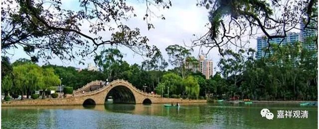

**
**

** 《菩提速道》109（下）**

把你放在那个位置上——其实把任何人放在那个位置上，只要不是太恶劣的人，都会生起相应的利益大众的心。有一次我在香港，正好碰到香港特首的选举，曾荫权当时的广告就是：“我想当好这份差。”他在那个位置上讲的这句话是真心的，他就想把事情做好，真的是为了更多人的福祉想把事情做好，除了一些非常特别的情况。这个反过来，可能就是互为因果吧。你真的想到了这个程度，你就会有相应的异熟的果报。

那么，等你真的做到了比如说转轮圣王等等，你又会发觉你是无力的，从大数据方面来说，你能够帮助多数的人，但是你又不得不牺牲一小部分人的利益，甚至对于这一小部分人来说，你的行为可以说是伤害。如果你是一个慈悲心很强的人，你就觉得这个事情你也很难受，所以很多国王就出家了，是吧？

** “总的说来，虽然业是自己的，然因慈力特别地超胜，若真实地生起慈心，也能利益他人。就像经中所说的慈力王一样。**

** 因此，即使生起口头禅般的慈心，也将是自己最胜的守护。世尊就是以慈心三摩地调伏了亿万魔军。”**

** **

基诺里维斯和英若诚演的那部《小活佛》那部电影真的拍得很好，魔军在对面射来无数的箭——这个箭其实比喻的是嗔心，然后到了佛陀的周围，就变成庄严的鲜花了。这是基于什么呢？就是基于慈心的力量而进行了转化。魔军对于佛陀的伤害，因为他的慈心都变成了他的庄严。如果就具体的例子来讲，很有可能是别人伤害了他，结果他却一点也没觉得这是对他的伤害，于是周围的人都传称他是多么的慈悲。这部电影当中的这个细节真的拍得很好，看一遍的时候还没感觉，以后越看越觉得细节拍得很好。

我看有好几位演和尚演得好的演员，后来都出名了。比如濮存昕，对吧？基努•里维斯也是，黄晓明也是，对吧？还有那位演唐僧的也是，好像最后腰缠“亿”贯，是吧？演戏的时候其实也是这样的，因为他在那个境下，就也要生起相应的心嘛，要生起那种悲天悯人的心等等，哪怕是一点点，也很了不起啊。心理学里面说“行为改变心态”，先试着做也是很有实践意义的。

要不我们以后排舞台戏吧？每年几个佛教特别的纪念日排一点舞台戏，大家来演一演。我曾经演过优婆离，现在做和尚了。（当时搭班子演佛陀的那个人回家结婚了，他没有出家。）

