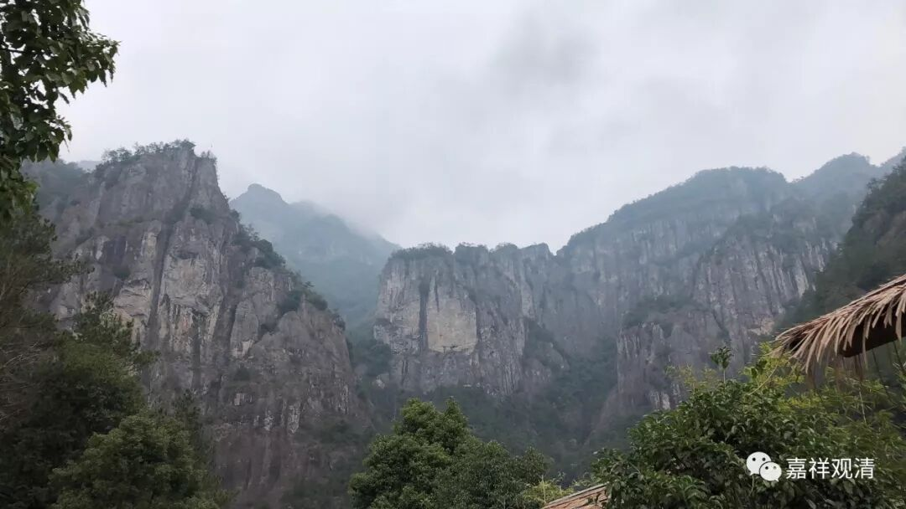

**《菩提速道》110（下）**

有人问抗日战争时期加入部队的和尚们该怎么算，这应该要因人而异，单独判断的，而且也不太容易判断。有时候有的人就是生起嗔恨心的，也有些人是愚痴的，这些都不能确定，要判定这些行为是不容易的。

说到一切有情都做过我们的母亲，就是连苍蝇蚊子也做过我们的母亲啊，所以都不能打。所有的有情都做过我们的母亲，所以说修知母的量，就是要看到一只苍蝇都会眼泪掉下来：“娘啊！”应该是这样的。

** “还说：‘因此，听到慈的名字，我的心中就感到非常的清朗。’”**

** **

大师是我们的榜样，我们也要学习哦。

** “慈心的利益者，如经中说：**

** ‘遍于无边俱胝刹，尽其无量诸供品，**

** 以此常供诸胜士，不及慈心一数分。’”**

这个“不及慈心一数分”的意思就是，祭祀崇拜……不及你去修一点点的慈无量心定。一样地，你去朝拜佛无数次，不如你去修一个空观。

** “怙主龙树菩萨也说：**

** ‘天人皆慈爱，彼等恒守护，**

** 喜悦多安乐，毒刀不能害，**

** 无劳事得成，当生梵世间，**

** 设未能解脱，得慈法八德。’”**

** **

修慈心，就能有这样的好处。即使你修慈心没有能够得到解脱——“设未能解脱”，至少你也得到了修慈法的八种功德。

在《尊者阿迦曼传》里面也有讲到，尊者在给德国来的那些天人讲经的时候，他的第一反应就是：“他们是初禅天，是修四无量而成功的。”于是，他就给他们讲四无量，结果对方还真的就是很喜欢听四无量。所以有人说什么“各个地方有各个地方的神，互不相关”，恐怕是不正确的。阿迦曼尊者看到德国、法国的这些天神过来，他就在初禅天给他们讲四无量，而这些天神们就很高兴地作礼致敬。

** “‘每日三时施，三百罐饮食，**

** 然不及须臾，修慈福一分。’”**

** **

“须臾”是指很短的时间，大概15分钟左右，或者是45分钟？这个不用太认真啊，意思就是用很短的时间去修慈心，获得的福报也会很大。

后面就是讲悲心了，我们先休息一下。

