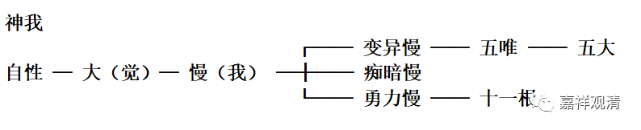
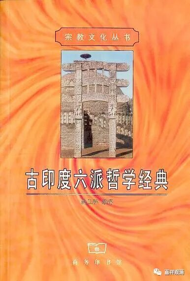

**数论二十五谛的异说**

（一）

在谈到印度数论派哲学二十五谛时，二世嘉木样大师的《宗义宝鬘》（陈玉蛟译本）中说：

……从“主”产生“大”……从“大”生“我慢”，而“我慢”分为：具变易的我慢、具精力的我慢和具昏暗的我慢。从前者生“五唯”，再从“五唯”生出“五大种”。从第二者生出“十一根”。第三者能影响（制约）其余二种我慢。

这里的“主”，就是通常翻译的“自性”

列表，如下：

** 神我**

**  ┌── 变异慢 ── 五唯 ── 五大**

** 自性 ─ 大（觉）─ 慢（我） ─┼── 痴暗慢**

**  └── 勇力慢 ── 十一根**

这和现存的《数论颂》是一致的：

《数论颂释》（《古印度六派哲学经典·数论颂》·姚卫群，P155）：

……由自性（生）大，然后（生出）我慢，由此（我慢生）十六（谛）系列，在由此十六（谛中的）五（唯生）五大。

《金七十论》的说法也与此一致——

《金七十论》：

自性次第生，大我慢十六，

十六内有五，从此生五大。

 “自性次第生”者。……自性先生“大”……“大”次生“我慢”……慢次生十六。“十六”者：一、“五唯”。……次，五知根……次五作根……次心根。……五唯，……生五大……

此说，“十一根”由（勇力）“慢”生起，“五大”由“五唯”生起。此十六谛，是所生，非能生。

《数论释》说：

它是依赖的，即依赖它的因：觉依赖自性；我慢依赖觉；十一根和五唯依赖我慢；五大依赖五唯。它是回归的，具有回归的特征：在解体时，五大归于五唯；后者与十一根一起归于我慢；我慢归于觉；觉归于自性……

