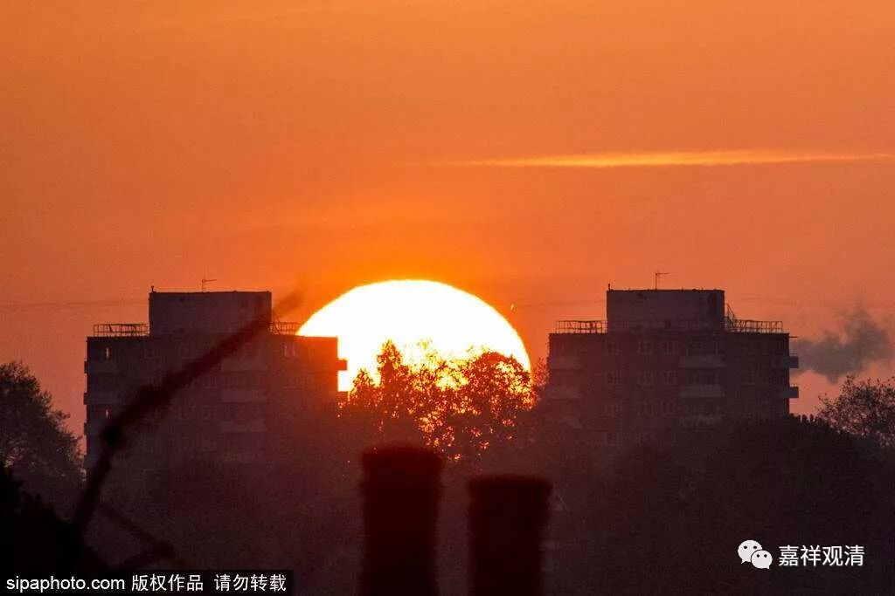
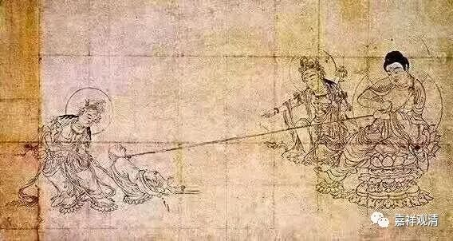

**
**

** 《菩提速道》112（中）**

当然，终极而言还要说是有缘的，所有众生都做过我的母亲嘛。但是，就好像佛陀虽然和你有缘，你要是死犟的话，他也没有办法现在来度你……。

那么，二地菩萨所度的众生，就是他在初地的时候引导的，三地菩萨所度的就是他在二地之前引导的，是吧？当然我是开玩笑啦。我想大致也差不多吧。

** “这样祈祷以后，观想顶上上师天身，犹如烛光一分为二般，变出第二尊化身融入自身，”**观想自己变成佛了。（记住这是观想，就凡夫的我们而言，观想仅限于观想，有些人观想以后过分high了……大哥，数数你的烦恼，算算你的功德，你实际应该做的是别放弃、别自卑吧）。

** “由此胜解‘在八大狮子擎举的高广宝座上，种种莲花日月轮垫上，自身变为本师释迦牟尼佛，身紫磨金色’直至‘金刚跏趺而坐’。”**

** **

这个是仪轨当中的内容。

** “然后修习强烈的欢喜心和我慢：‘就像前面所发的牵引愿力那样，为了利益一切有情，我已证得佛果！’”**

** **

这个是想想的哦，别以为真的是这样啊。到了一定都程度是这样的，但绝不可能是跳级的，千万别想跳级，别做梦了。今天连贪嗔痴是什么定义也没有梦到过，明天突然之间就观想顶上的上师降落心间，“咣当”地成佛了。然后你问他：“什么是贪嗔痴？”“不知道。”这种“佛”也不知道哪里有啊？！

** “据说此中有着特别的缘起扼要。”**

** **

这是有其特别原因的，对我们的心有一种加持力，有一种好乐心——我要这样。类似于今天的一些心理治疗手段——把你想象成你认为完美的那个人。这样，会对你的行为、心理产生作用，努力向偶像看齐……

