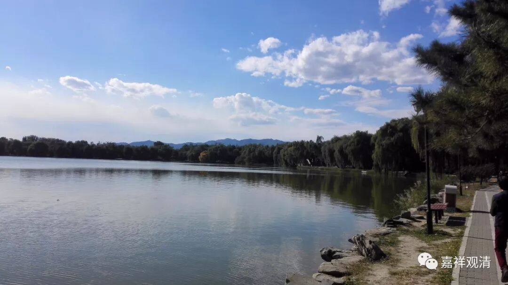

**《菩提速道》讲记118（上）**

还有这里的“惟愿上师天加持令我能如是而行”，大家看到整篇里面都是这样的话，好像这句是最重要的。其实这只是仪轨的一部分，最重要的是你自己修行的那部分。然后，在你修行得比较累的时候，再观想上师本尊降甘露，或者是你自己能力不够的时候，心比较弱的时候，请上师本尊加持。要不然的话，整个道次第就变成不是修行，而是菩提道次第祈祷成就法了。

大家要知道不是这样的啊。道次第当中，包括佛教的其他内容当中，当然会有这些祈祷的部分，因为宗教发展到一定程度是一定会有祈祷这部分内容的，但是真正的核心还是要自己修行，这些内容都是要自己去实践的。修行了以后，觉得自己累了，就观想一下，或者是自己能力不够了，准备喊“苍天啊、大地啊”的时候，就应该观想菩萨降甘露灌顶。

** “戊二、发心后修学菩萨行之理，分二：**

** 己一、修学总菩萨行。**

** 己二、别学后二种波罗蜜多。”**

** **

总菩萨行包括六度，是吧？已经习惯地用六度来说总菩萨行了。那么，在六度当中是包含了禅定波罗蜜多和智慧波罗蜜多的。按照《菩提道次第广论》的写法，是在讲完六度之后重新再讲一遍止观的，所以其他道次第的论著基本上都是根据《广论》的习惯，把六度讲完以后再别说后二度的止观部分。

** “初者，分二：**

** 庚一、座中如何行。**

** 庚二、座间如何行。”**

** **

修行就是分两个，一个是座中，一个是座间。

** “初者，分三：**

** 辛一、加行。**

** 辛二、正行。**

** 辛三、结行。**

** 初者，加行：**

** ‘遍摄依处上师殊胜天，能仁金刚持前诚祈祷’等以上部分同前，”**

** **

这里也是一样的，如果简单点就念《菩提道次第成就盛宴》，或者是《乐道》的祈祷文当中正行前面的部分。最后这一段就是“遍摄依处上师殊胜天，能仁金刚持前诚祈祷”，这个是正行部分的开始。前面所修的内容和最初的道前基础当中所修的那些内容都是一样的，所以就不多说了。

