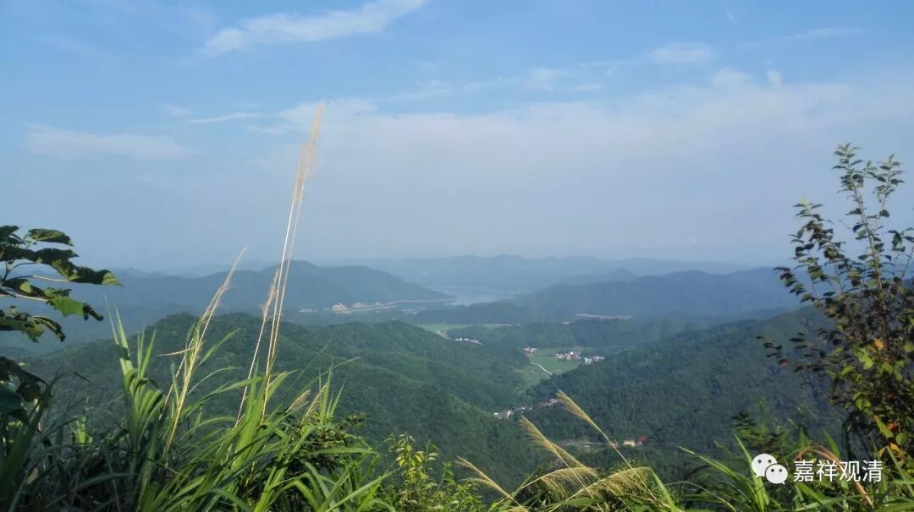

**《菩提速道》118（中）**

** “然后祈祷：**

** 惟愿上师天加持我及一切慈母有情皆能如理地修学甚深广大的佛子大行！等等。”**

** **

既然是甚深广大的佛子行，就应该以自己的实践为主哦。自己的实践，再配合这样相应的观修和祈祷。这两个方面都要有哦，就是一方面是自己的技术层面先修行，修到累了或者差不多结束了，最后再修一个甘露灌顶、甘露降净之类求加持的内容。

一天修四座的时候，也不一定每座要把这22页都念一遍，你每座都念一下当然好啊。哪怕四座都是仅仅只念《兜率百尊》也可以的，其实念略的内容也可以。你可以看其中的那些科判，按照科判来念，中间的很多内容减少也是可以的。或者直接念《兜率百尊》也可以，这个已经很短了。里面一些很广的部分，比如“嗡班杂普弥阿吽……”就不需要念了。或者是忏悔的部分，有一大堆内容，念一念“我昔所造诸恶业……”这一颂，就算过去了。都是可长可短的。

那么，前面每一部分的内容，比如说二十二所缘，其实二十二也可以，四十八也无所谓的。这些二十二个所缘等等内容是不一样的，但是甘露降净的这部分内容都是一样的，甘露降净所获得的加持的内容是根据前面来的。

这和我们平时做一些训练是一样的，它既有技巧部分的不同的层面，也有最后修同一个层面的。比如说我们现在练武术，前面是分别练技巧、练肌肉、练速度等等，等到练完以后，再练一个力量——做4组深蹲、5组卧推……这个是你每次练习以后都需要的，练力量。技巧呢，则不一定的，今天你练这方面的，明天练那方面的。技巧全部练完以后，最基础的核心部分应该都差不多的，就是练力量的这部分都差不多。

时间充足可以按广的来修持，有事或者时间不充裕可以依略的来修持——一张一弛，文武之道。但有些人一概只按照略版来修持……那样，反正因果在那边——没有能投机取巧的功夫。

