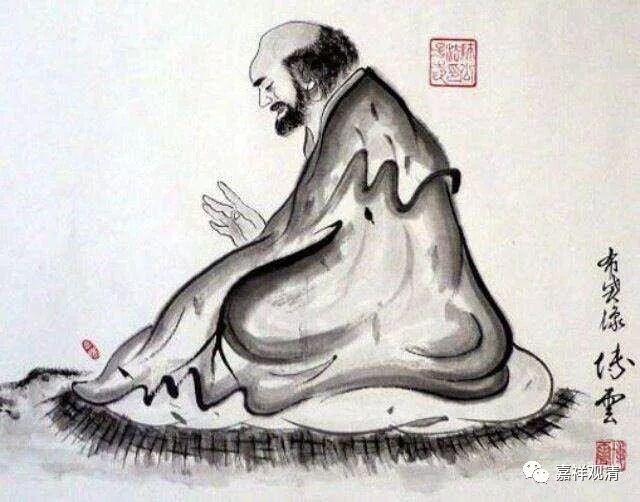
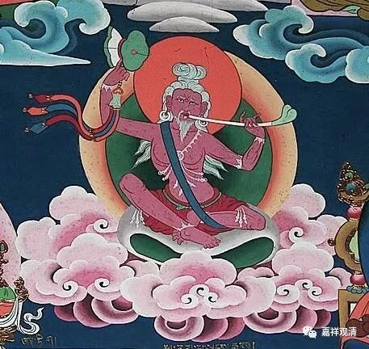
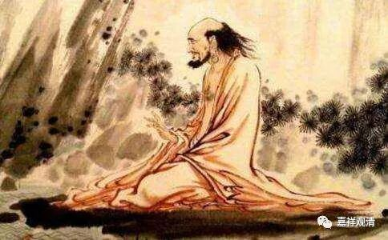

**《菩提速道》120（下）**

** “如是思惟而行布施。”**

** **

这种“如是思惟”是比较功利的一种，但是他仍然是在劝你布施的。

对我们来说，应该慢慢慢慢地把这种功利的思维过渡到道德的思维，变成“这是我应该做的”。一般的这种对自他都好的思维方式，还是有点接近功利的。

应该怎么思维呢？“就该这么做！”你在修行当中有很多苦行，可能对自己现在的利益或者是短期内的利益都看不见，而且是很痛苦的，但这些也都是应该做的，我们要看长时的结果。

** “如《入行论》中说：**

** ‘一切终顿舍，施诸有情胜。’”**

** **

你死的时候，一下子就没了嘛。你都管不住了，还不如布施给其他人呢。

** “《本生论》中说：‘施得珍财藏。’**

** 另外，阿底峡尊者说：‘来世较此世长得多，为了来世的路粮，当把珍宝埋藏到宝藏中。’”**

** **

这个宝藏，就是指三宝。埋藏到三宝当中，对吧？或者埋藏到众生当中，埋藏到佛的无尽的事业当中。类似于，放在佛陀信托、三宝信托、有情信托里面，这样就永远不会用尽……

** “帕当巴说：”**

** **

帕当巴桑杰，是印度的一个祖师，事迹和我们的达摩很像的人。在某地（你懂的）他们说帕当巴就是达摩。他们的考证就是这样简单：这两个人的行为很像，所以这两个人就是一个人。实际上这两个人所处的时代要相差至少四、五百年，对吧？

达摩是什么时候啊？达摩是在唐代以前，在南北朝的时候啊，梁代时见过梁武帝。帕当巴桑杰是在什么时候呢？帕当巴桑杰是在阿底峡尊者的那个时代，大概相当于内地的宋代，公元1100年或者1200年左右。这中间差了多少年啊？六、七百年都不止。某地说这两个人是一个人……传说和历史还是分不清啊。

