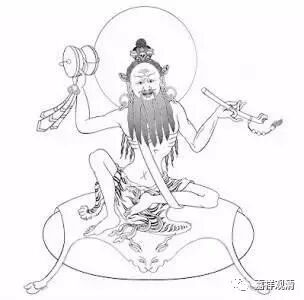
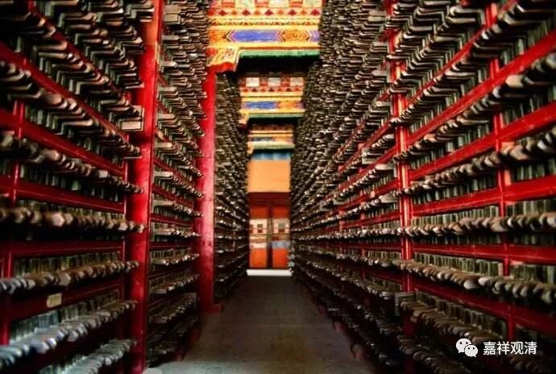

**《菩提速道》讲记121**

这位帕当巴桑杰还挺有趣的，他和米拉日巴两个人进行斗法，看谁的本事大。比试的结果是两个人的水平差不多，但是在最后呢，帕当巴桑杰就站到一根草尖上去，然后米拉日巴也站到另外一根草尖上去，那跟草尖就往下弯了。

帕当巴桑杰就以战胜者的姿态说：“实际上我们的水平是一样的，但是因为你的种姓问题，你站的草尖就往下弯了。而我的种姓比较高，从小就是吃素的，草尖就不会弯。”（不过，这个是不是信史则……）

帕当巴桑杰到藏地去过两次，后来西藏有两个比较重要的派别可以说都是由他传承下去的，早期有一次，后面又有一次，一个叫希杰派，一个叫觉域派。这两个派别现在基本上都不以独立宗派的形式存在了，有的人说自己是这两个派别的，但实际上独立的派别已经不存在了，传承则是在格鲁派等大宗派当中流传下来了。

在希杰派和觉域派快要灭亡的时候，那两个派别的人特别少，快要断传承了。那个时候，二世嘉木样大师有一位弟子叫索南智华，是拉卜楞寺系统的一位大格西，当时他在三大寺学习，水平非常好，当时是准备要考头等格西的。二世嘉木样活佛就给他写了封信，对他说：“你就别考头等格西了，没你的事。你现在去到西藏南面的XXX，把觉域派的断法都学过来。”

索南智华格西接到信就走了，把头等格西的名位弃之如草芥。他来到西藏南部，就学习了觉域派最主要的断法，学完之后也就不再回拉萨，而是直接回到了甘南。后来索南智华——简称也叫索智堪布，在拉卜楞寺大经堂的右后方，建造了一座大白伞盖殿，他后来也做过拉卜楞寺的总法台。

就这样，帕当巴桑杰所传的觉域派快要失传的法，是二世嘉木样大师派他的弟子去继承下来，然后带回了拉卜楞寺。

二世嘉木样大师呢，是一个非常接近于现代学术思维的人（难道是穿越回去的大师吗？）。他在藏区这样的环境下，他有了建造图书馆的愿望，而且收藏了很多类似于民间的或者不同版本的书籍，这种思路在三五百年前的藏区是很少见的。他自己到处搜集了很多书籍，都在拉卜楞寺保留了下来，还搞了刻经院，给桌尼版大藏经写序言、提要……他还分派了他的弟子到各个地方去接受传承。拉卜楞寺就在第二世嘉木样大师的时代又有这种新的发展。实际上每一世的拉卜楞寺的寺主大师都有他们与前任不同的特点。

那么，觉域派比较重要的法就是大家经常听到的这个“断法”。觉域派和希杰派都属于小派别，是帕当巴桑杰两次去藏区分别留下的传承。

