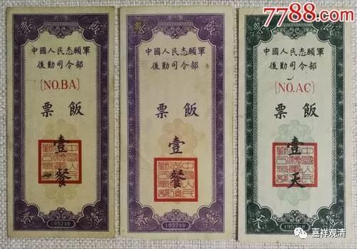
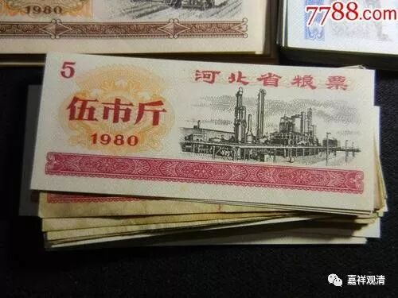
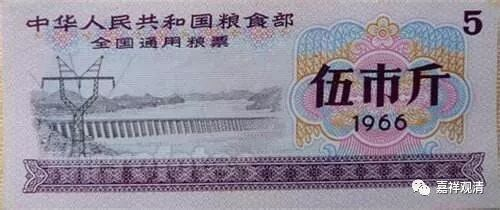

**《菩提速道》121（中）**

** “帕当巴说：**

** ‘友中多已赴后世，有路粮否？定日人！’”**

** **

这是祖师帕当巴说的一句有寓意的话。这里的“定日”应该是一个地方。

“朋友当中很多人已经去了下一世，怎么样，你准备好了（去来世）路上的粮食了吗？”这句话说的情况就是自己的朋友当中，很多都已经不在世了，那么，你该想想，你准备好了吗？所以有时候我会想想，假如这种情况发生了（我不知道你们怎么样，我觉得挺凄凉的），假如真的老到这个地步，所有同龄的有朋都不见了，就你一个人在那里念旧——也挺惨的哦。

和我们相差十岁的八零后们，相处之际，已经觉得有严重的代沟了（现在据说三岁一个代沟）。如果等到我们的牙齿都快掉光的时候，在我们面前的是和我们相差了将近半个世纪的人，思维方式完全不一样的，和他们怎么也聊不到一块去啊！那个时候……可太惨了。

** “有路粮否？”**

** **

你路上的粮食准备好了吗？（如果是二十年前的话，那会问：“准备了粮票了吗？”去外地还要问“准备好全国粮票了吗？”）你准备好了资粮了吗？！答案可能有点惨。** “定日人！”**你我都是那个被问的“定日人”。

** **

** 最好是在菩提心的摄持下，中等应在厌离整个轮回的出离心，最下也应希望增上生中不乏受用，在这样的意乐摄持下努力修行布施。”**

** **

那么，布施的心可以有这样几种，各种情况都可以有的。** “最下也应希望增上生中不乏受用”**，指的是，作为修行人来说，最差你也应该要为下一世的利乐来布施。如果你仅仅是为了今世来布施，那么畜生也会有的，它们也懂的，所以这里的“最下”至少也得是希望后一世不乏受用。中等的要准备解脱的资粮，上焉者则当以菩提心的利他来摄持。

