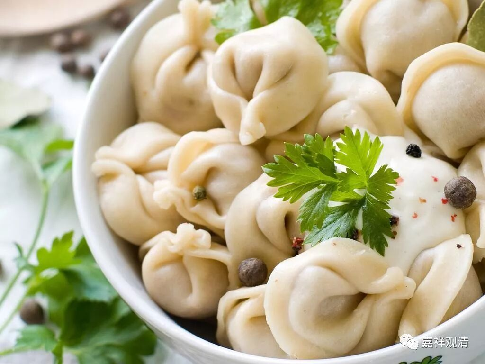
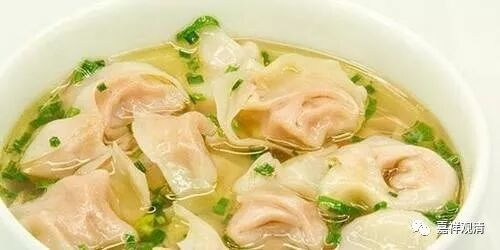
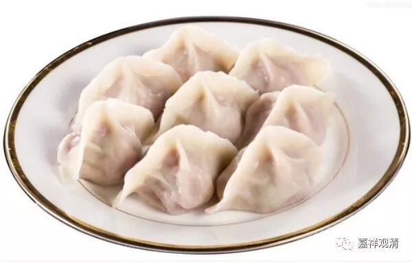

这是馄饨还是饺子？

**外来的馄饨和饺子**

今天谈谈饺子和馄饨，我们总以为饺子、馄饨是中国人的传统美食，但实际它却是（西域）外来的面食做法。只是时间久了，竟成为“中国传统”，可见传统也是无常的。还是先从佛教谈起。

馄饨，原是印度或者说西域的面食，《十诵律》卷三十四：

** “佛在王舍城竹園中。諸居士辦種種帶鉢那，胡麻歡喜丸、石蜜歡喜丸、蜜歡喜丸、舍俱梨餅、波波羅餅、曼提羅餅、象耳餅、餛飩餅、閻浮梨餅，持是餅向僧坊。**

** 六群比丘早起在門邊立，見已問言：‘持何等物？’**

** 答：‘種種帶鉢那餅，所謂胡麻歡喜丸、石蜜歡喜丸、蜜歡喜丸、舍俱利餅、波波羅餅、曼提羅餅、象耳餅、餛飩餅、閻浮梨餅。’**

** 六群比丘言：‘我欲行去，先與我等胡麻歡喜丸、石蜜歡喜丸、舍俱梨餅、波波羅餅、曼提羅餅。汝持象耳、餛飩、持閻浮梨餅入與上座。’**

** 諸比丘不知云何？是事白佛。**

** 佛言：‘應羯磨立分帶鉢那人。分帶鉢那人，應和合等分。若更有美者來，亦應次第與。若今日不遍者，明日更有，應續次與。’”**

说，有居士带了很多面食去寺院供养僧众，正好碰上六群比丘，六群比丘取走了好吃的“欢喜丸”，把剩下的留给长老……这些面食当中，就有“象耳”和“馄饨”。这里的“饼”，当时还是作为面食的统称。

慧琳《一切经音义》在解释“馄饨”时说：

“餛飩（胡昆反，下徒昆反。《廣雅》餛飩，餅也。）”

就说“馄饨”是一种面食。

崔鬼图注《北户录》“混沌饼”时说：“《广雅》曰‘馄饨’也。《字苑》作‘餫’（yun）。颜之推云：‘今之馄饨，形如偃月，天下通食也。’”“形如偃月”，不就是饺子吗？

按，“饺子”，又叫“扁食”，而“馄饨”也叫“扁食”。据《汉语方言大辞典》，今锦州、天津、保定、西宁、临汾、太原、呼和浩特、乌鲁木齐、徐州、南通等地称“饺子”为“扁食”，宜宾、如皋、玉山、厦门、福州、台湾等地则称“馄饨”为“扁食”；据《昭通方言疏证》，昭通人说的“饺子”就是大馄饨。

《武林旧事》谓：“冬至享先，则以馄饨。”说冬至祭祖用馄饨。《剑南诗》自注说：“乡俗岁日必用汤饼，谓之冬馄饨，夏馎饦。”“馎饦”，就是汤面。“冬馄饨，夏馎饦”，这话翻译成今天的白话，就成了今天老北京说的“冬至馄饨夏至面”。网络上著名的南北互掐，有说“冬至吃饺子&冬至吃汤圆”，则“馄饨”、“饺子”又出现在同一位置。（今天没买到饺子，吃的馄饨，吃对了。）

我曾经问过一个俄罗斯翻译，她证实，俄罗斯人也吃饺子，只是饺子皮做法略有不同——他们把面团在桌上展成薄饼，用杯口压出一块块饺子皮。（我觉得真是学了一招。）

话说《济公传》当中有个情节：又是一个下雪天。济公去酒店点菜喝酒却没带钱，酒保不许他赊账，要他拿衣服去当了还酒钱。济公说：我就是个“菜馄饨”——衣服里面我就是馅儿了，怎么能当衣服？！

