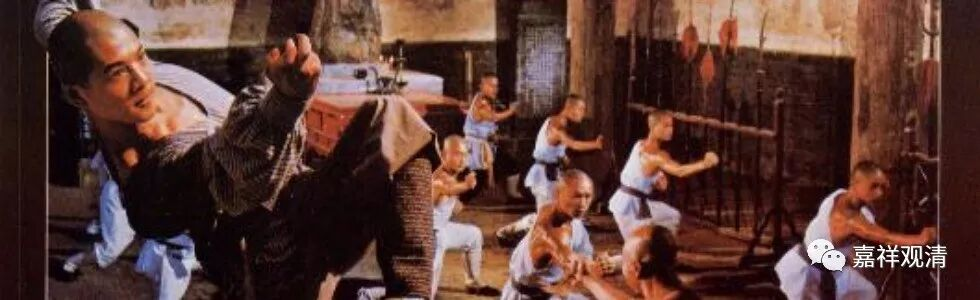
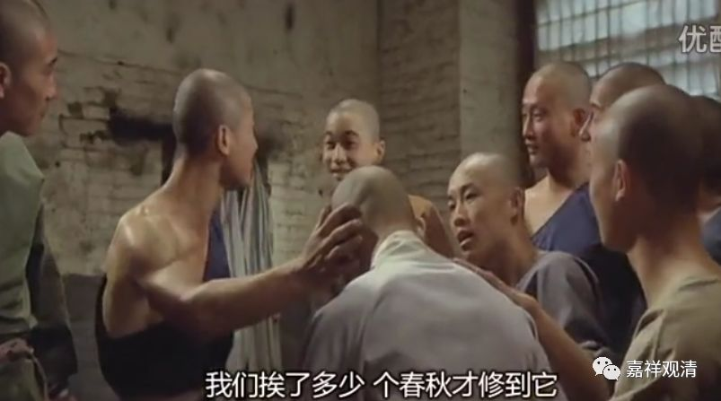
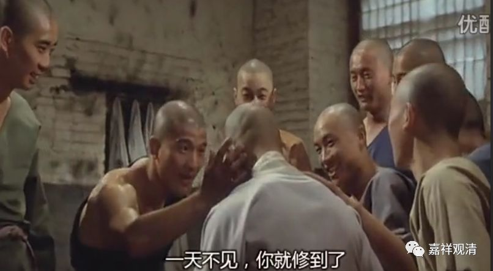
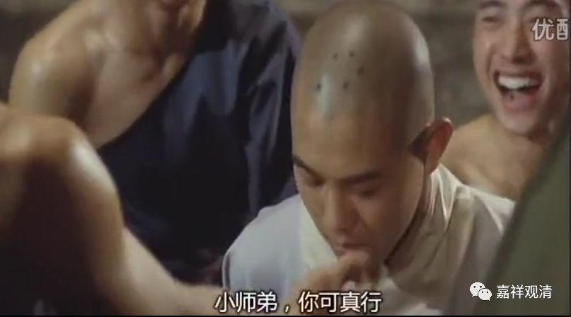
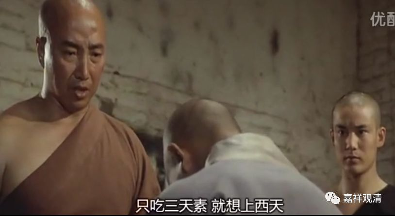

**《菩提速道》122（中）**

** “（三）安忍波罗蜜多：**

** **

** 其后为安忍的修持，在顶上修习上师天的状态中，如是思惟：为利一切慈母有情，无论如何我当速疾证得圆满正觉的大宝佛位！”**

** **

下面就讲了安忍有三个：耐怨害忍、安受苦忍、谛察法忍。

** “（耐怨害忍：）为此，即令一切有情与我为仇，我也不应生起刹那的嗔恨心，而且对于他们的怨害，回报以利乐，令自他心中都能圆满安忍波罗蜜多等一切佛法。”**

** **

太厉害了，菩萨真是太伟大了！我真的做不到。我们都是以眼还眼，以牙还牙，特别是最近练武了以后。所以我最近一直都在反省……

有一次我在路上走，突然一个女的抱着孩子跟在我后面说：“嘎唔嗓——假和尚。”我当时一回头，把眼睛一瞪，说：“觜卟仿亲桑臬！——嘴巴放干净点！”后来我走出去没几步就想：“这样真的好吗？”（她这么说，是因为我头上没有戒疤，她认为没戒疤就是假和尚——电影看多了！《少林寺》电影里就说有戒疤就是真和尚的标志……话说，练武脾气容易大，真的。）

也有一些人就不一样，且不管他们真的还是假的。我在这附近走动的时候，后面有几个民工带着帽子骑着自行车过来，就对我说了句“阿弥陀佛”。这样也挺好的，种个善因。

以前我曾对寂如师讲：“哎，这两天怎么样？没事我们就到路上走走吧，去度一下众生？”后来我们才发觉，搞不清楚这样是害了他们还是帮了他们。很多人都是上面这两种情况，当然也有比较尊敬的。其实我们大家一般在路上碰到出家师父的话，可以合个掌，说一声“师父好”或者“阿弥陀佛”，都可以。

我碰到过最有趣的一次是，我坐地铁7号线，从静安寺上车的。有一个大概二三十岁的年轻人，在他下车的时候，直接跑过来往我手里塞了50元钱：“师父，给你。”我还没有反应过来，他已经下车了。

还有给我让座的，大概碰到过两三次。有一次是在人民广场坐车，上去挤得一塌糊涂，结果有一个年轻的二十多岁的女性，站起来给我让座。这是我第一次碰到给我让座的，一般都是我给别人让座。

