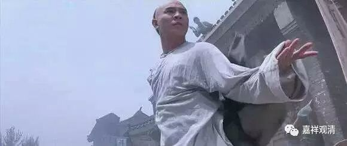
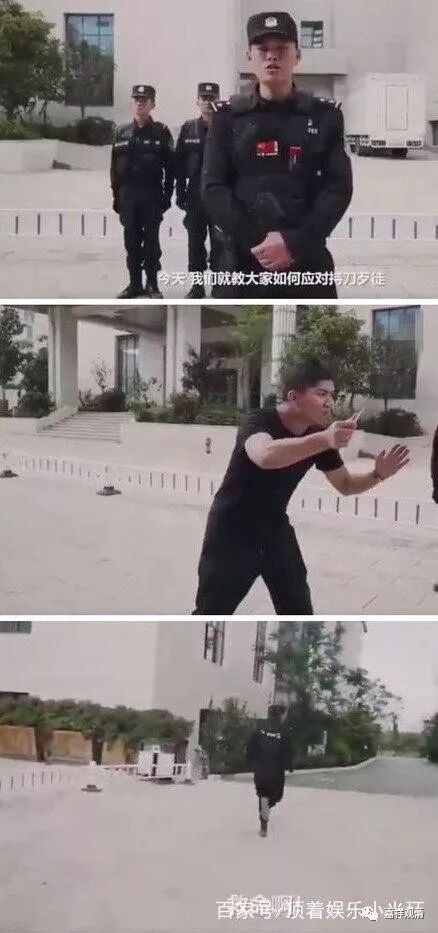
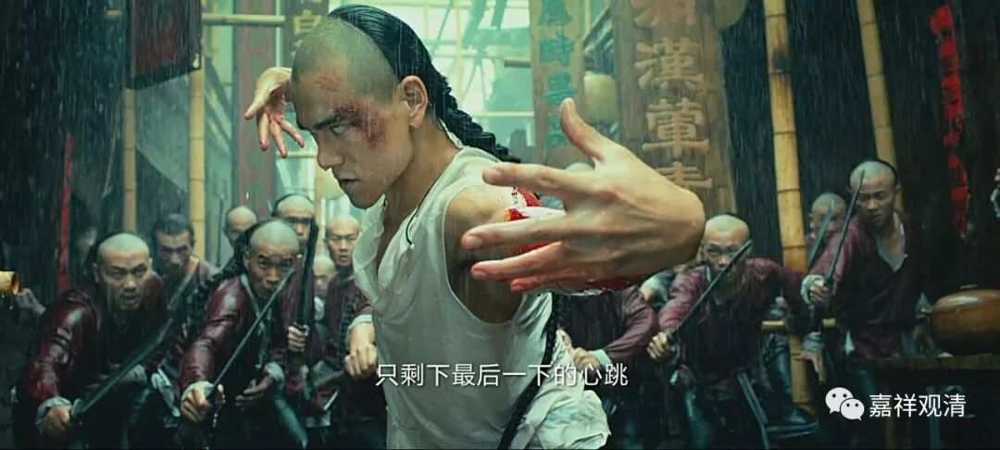
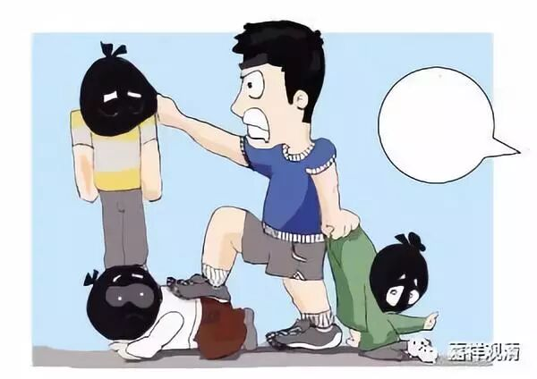
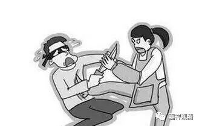
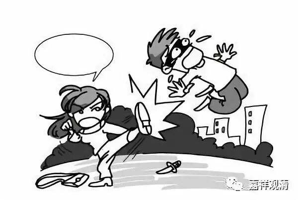
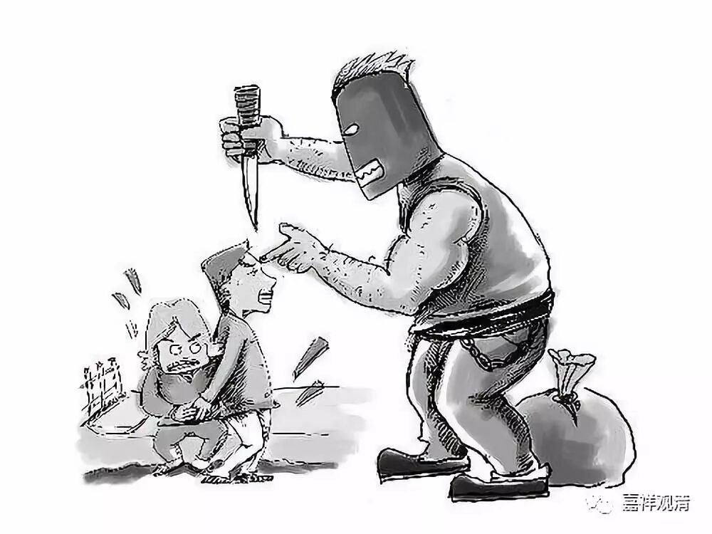

**《菩提速道》122（中）**

有时候观察起来，好像在马路上违纪闯红灯的老年人比较多，但年轻人也有。当然老年人会比较多一点，他们好像更加有点有恃无恐的样子。有一段时间我也觉得这点挺烦的：怎么老年人老是这样呢？太吓人了。

我和我弟弟聊过这个话题。其实中国一直是个特权社会，而大部分中国人的经历，从年轻一直到老，都没有特权的机会。等到他年纪大了，他突然发现自己多了一个特权——“我老了”，就是大家都不敢冲撞他。有些甚至会撒泼，躺在地上等等，他就认为你不敢对他怎么样嘛。

以前他是没有特权的，没有人家必须要谦让他的情况。现在哪怕是政府部门找过来，他就是耍赖，你也不敢把他怎么样，的确是有这个原因的。上次我曾经看到一个场景，都被吓愣了，太恐怖了。一个老头就在前面的那个十字路口，推着婴儿车斜穿马路。这个太恐怖了！如果被他的孩子看到，不知道要被骂成什么样了。斜穿马路——这里根本就没有任何的人行道。

看到这些现象怎么办呢？管还是不管？特别是当别人伤害你的时候怎么办呢？特别是危及生命的时候。从世俗的角度，我们佛教徒真的是要做到打不还手骂不还口吗？佛教有没有正当防卫一说呢？我知道大菩萨有办法，我们凡夫有什么好的处理方式吗？（大家可以讨论一下。）

武术界，专业的说法是——遇到危险，第一逃命，第二逃命，第三还是逃命。这个，网络上武警叔叔都已经专门出了视屏给我们做了示范了。

记住！这不是搞笑，这是专业！千万不要学电影里面走到敌人中间展示拳脚，那是花式找死。

记住，现实中黄飞鸿打架没这么帅，他见到一帮流氓出来，也是先跑的（等追兵们渐渐一个一个拉开距离以后，再针对一个一个下狠手，每一次出手都要求一击必中，必须令每一个对手再没有站起来的机会！……你如果没这个能力，只管跑就是了！）。

以下几种都不推荐——

所以呢……我现在练长跑比较多

这个“耐怨害忍”修习起来很难啊！所以我的一位师父在几年前就对我说：“你每天睡觉前要修修慈悲观。”我觉得他看准了，我脾气有点不太好。我还问：“可以单独修吗？”他回答说：“可以单独修，修慈悲观。”我觉得练武的人都应该修慈悲观。

