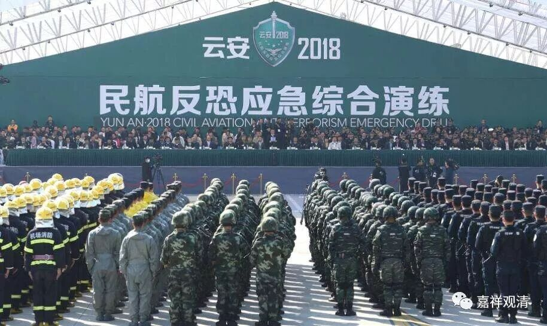

**《菩提速道》122（下）**

** “（安受苦忍：）另外，《入行论》中说：**

** ‘若截杀人手，能脱岂非善，**

** 若以人间苦，离狱岂非善？’**

** ‘苦具诸功德，谓厌能除慢，**

** 悲悯生死者，羞恶而喜善。’”**

** **

“若截杀人手……”，这是说，假如一个杀人犯，本来要被执行死刑，但临时改为砍手——那这个犯人一定对这样就能脱罪而感到高兴。同样的，如果微小的人间苦痛便能脱自己以前所造的恶业、能免堕地狱，那岂不是最好的结局吗？就是说，假如我被人打、被人砍等等，首先这个果肯定在以前有其因的，是吧？如果现在被别人伤害的话，那么这个因的业就报掉了，同时还能免除地狱之重罪，简直太好了嘛。（能这么想的人真是太伟大了！）

下面有注解：

** “例如一个束手待杀的人，若因断手而得以逃命，岂非明智之举吗？同样，若藉着忍受辞亲割爱等人间修行的小苦，而脱离地狱等大苦，岂非更为明智吗？”**

** **

这就是上面颂文的解释。

** **

** “当财食卧具等匮乏，或者疾病等不希望的痛苦不期而至之时，应该想到受这样的痛苦是过去所积恶业的果报，”**

** **

如果我们有这样的反应就好了。我们怎么才能有这样的反应呢？其实很简单——观修。那什么是观修呢？

海军演习

陆军演习

消防演习

反恐演习

我们看，公司、单位、学校里会有消防演习，飞机、轮船上也会有反恐演习，这些演习就是让我们在真正发生突发事件的时候有个预案，有准备好的处理方式，不断地纸面推演和实际演习，经历次数多了，你就会非常熟悉突发事件的应对方法，当“突发”变成“平常”，你的应对也会有章法。其实，“修行”不过就是如此——日常学习，纸面推演，观修演习（我觉得将来还可以做更实际的演习，我们可以试试。比如观死无常，现在有事先写遗书，然后爬棺材里去一个小时的做法是吧，我觉得挺好，可以试试）。

** “由此可以净化许多恶业，不应当厌恶。**

** **

世间人的说法就是——消业。

** **

** 特别是，为了正法而产生的痛苦，若于此生起坚忍之心，依此会更接近于一切智道。”**

** **

修法一定不是轻松的，一定会有相关的“苦”，但因为你受了这种趋向于解脱的“苦”——解脱的因（其实这种苦早晚都得受），所以换来更接近于一切智道——佛果的究竟解脱。

** 因此，应当勇于承受这些痛苦，截断自他流转轮回恶趣的痛苦之流。”**

** **

所以，修行的苦要耐得住——安受苦忍。

不过，我们世间人一般都认为修行就是吃苦，也不管这个吃苦是不是真正能趋向解脱的，就觉得只要“吃苦就是修行”。实际上这个可不一定哦。有些修行的确是需要我们的身心有点痛苦的，特别是我们已经长期习惯了轮回，反轮回的做法会让我们的内心无比痛苦。比如我们已经习惯了吃坚果，如果把坚果放在你的面前还不让吃，这个也是无比痛苦的，虽然这是为你好。但是，并不是凡是吃苦都是修行哦！

