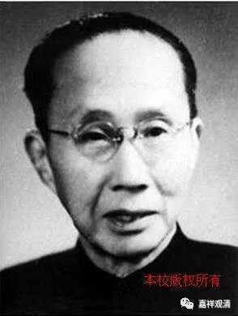

**《菩提速道》123（下）**

** “（五）静虑波罗蜜多：**

** **

** 其后为静虑的修持，在顶上修习上师天的状态中，如是思惟：**

** **

** 为利一切慈母有情，无论如何我当速疾证得圆满正觉的大宝佛位！因此，我应修习佛子无量无边的一切种禅定：从体性分有世间与出世间静虑；从品类分有寂止、胜观，以及此二双运的静虑；”**

** **

就是止、观和止观双运的静虑。

吕澂先生在他的著述当中说宗喀巴大师没有把静虑分为寂止和胜观，他的意思就是止观都是属于禅定的一部分。他认为宗喀巴大师没有这么说，其实包括《广论》等道次第的论典当中都提到了。应该说是吕澂先生当时可能没看到或者没注意到这方面的内容。他可能看到的是，在六度当中分别开出了定和慧，然后在很多地方都把止和观与第五、第六波罗蜜多来相对应。可能从这方面来看，他觉得宗喀巴大师并没有认识到止观二者都属于定学。但是在静虑波罗蜜多的方面，可能吕澂先生没注意到，实际上宗喀巴大师是提到了。

** “从作用分则有身心现法乐住静虑、引发功德静虑、饶益有情静虑三种。”**

** **

这些呢，都是《瑜伽师地论》里面的。《广论》以及相应的一些教法当中，大量地引用了《瑜伽师地论》里面的内容。

还有一点呢，就是前面有些地方讲六度的时候是分了三种，比如布施分为财施、法施和无畏施，然后《瑜伽师地论》是每一个都给了三种，那么大家背起来比较容易，科判起来也比较容易。换一种分法的也可以的。

大概是00年或者01年的时候，苏州西园寺第一届考试，我自己没答出来，还在那里叫嚣。当时有一道题目，说到戒分三种：定共戒、道共戒和律仪戒。考完以后我就提出质疑（不会做人啊，所以人家不愿意要我）。我说：“这题目出错了。”当然，我挑了他们很多错哦，这道题目也说他们出错了，结果被他们顶回来了。定共戒、道共戒和律仪戒，是有这种分法的，他们一说，我发现，对的，有这种说法的，有这种分法。其他的题目，我一直说他们出错了（当然也确实错了，哈哈），结果就得罪人了嘛。

** “惟愿上师天加持令我能如是而行！等等。**

** **

（六）** 般若波罗蜜多：**

** **

** 其后为智慧的修持，在顶上修习上师天的状态中，如是思惟：**

** **

** 为利一切慈母有情，无论如何我当速疾证得圆满正觉的大宝佛位！因此，我应修学通达究竟真理的胜义慧、通达世间五明的世俗慧，”**

** **

这个又是《瑜伽师地论》里面的，胜义慧、世俗慧。

** “以及通达利益有情的饶益有情慧等一切种佛子智慧。惟愿上师天加持令我能如是而行！等等。”**

** **

六波罗蜜多里面的后二度是别开的，所以第五和第六度就讲得比较少。在《菩提道次第广论》当中也是这样的，第五、第六度相应的展开不多，在后面又继续展开，单独讲止观。

般若波罗蜜多，这里面讲“通达究竟真理”，是吧？这个“真理”到底怎么理解呢？我觉得“真理”这个词，可能有很多理解的，还要把它理清楚的。

