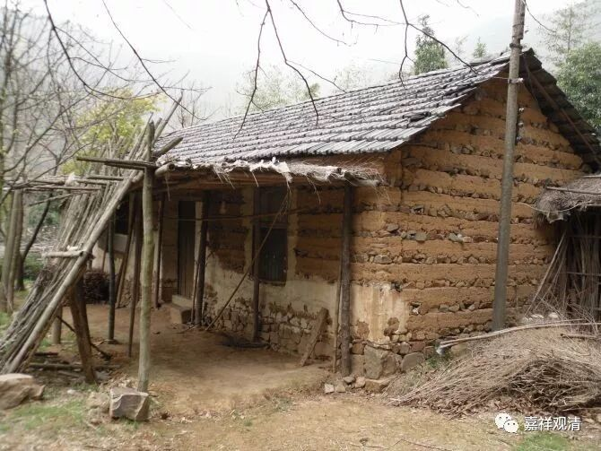

**《菩提速道》124（下）**

**
**

** “辛三、结行：如前所述。”**

** **

就是结行的方法和前面都是一样的。

** “庚二、座间如何行：**

** **

** 于座间也应当阅读开示甚深广大佛子大行的经典及其注释等如前。**

** **

就是不在蒲团上的时候，要学习相关的内容，别太闲散。

** **

** 己二、别学后二度，分二：”**

** **

在《广论》当中，一个很大的篇幅就是《止观章》。

** “庚一、修学静虑体性的寂止（奢摩他）之理。**

** 庚二、修学般若体性的胜观之理。”**

** **

所以呢，吕澂先生就认为宗喀巴大师把奢摩他和毗钵舍那完全对应静虑和般若，就和世亲论师所讲的不一样。其实这里的静虑体性和般若体性，应该说是指一部分、主要的内容吧，就是分别包含了静虑体性和般若体性。

……**
**

……

……

……（此段……请对照原文）

**
**

**
**

** “此外，如《经庄严论》中说：**

** ‘具慧修行处，易得贤善处，**

** 善地及善友，瑜伽安乐具。’”**

** **

就是去修习的话，先要找一个好的地方。道家就讲“法财侣地”，意思差不多。法，就是你要跟老师学习的修行的内容。财，就是你需要有相应的资具。侣，要有相应的朋友和老师。地，好的地方——不过百分百好的地方很难找到。这方面，大家的要求都差不多。

** “在外在环境风水和道友都很贤善的适意地方；安住净戒；不与太多人过于亲近；”**

** **

就是人少一点，不然容易互相打扰。

** “断除贪欲等诸种粗重寻思；”**

** **

把大的烦恼基本上断除，那些境都碰不到了嘛。以上这些内容在《瑜伽师地论》里面都有展开，有兴趣可以看一下。

** “安住少欲知足。”**

** **

背一百斤米上山，吃个一年，你想想看。差不多吧，一天有个三两米左右。做一顿饭总够了吧？然后你再种点土豆。一般闭关的，都是一百斤米一年，差不多就够了。我们还觉得自己的胃口很大，是吧？没菜，你还可以自己种地。其实以前哪有那么多菜啊！你们八零后就是没像我们七零后那样吃过苦（当然之前的更苦），是吧？

能海上师在拉萨的时候，别说菜了，有盐巴就不错了！传记里说“嚼盐吞饭”。后来在五台山也是，冬天下大雪了，就是面食和醋……我们现在的条件真是好了百倍了。

