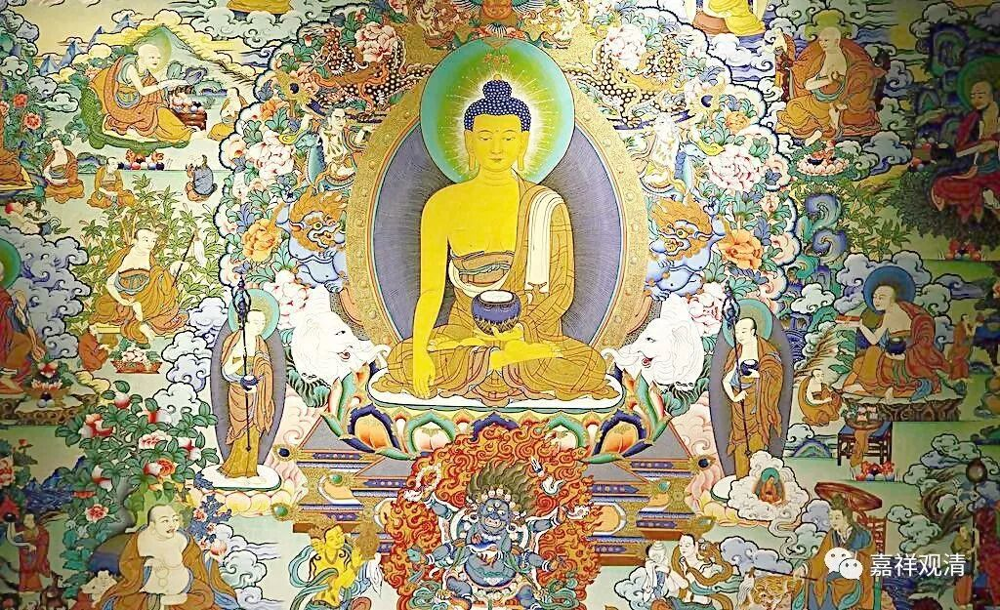

**《菩提速道》讲记126（上）**

这里就各个说法都有，有说在自己脐部的正前方观想佛像，有说在自己眉间的正前方，说在自己心间的正前方也有哦。这就有点像道家讲的“三田”——上丹田、中丹田、下丹田，完全可以一一对应嘛。（很有趣的事情哦。）

** “也可观想顶上上师天，犹如灯光一分为二般，分出第二尊上师天身融入自身，在八大狮子擎举的高广宝座上，杂色莲花日月轮为垫，自成本师释迦牟尼佛，身紫磨金色，乃至金刚跏趺而坐，朗然如空中彩虹，了无自性，一心缘此而修习。”**

** **

就是有两种观想方式，一种是把佛观想在自己的对面，一种是把自身观想为本尊，是吧？自己就变成本尊的样子。心理学里面用演情景剧来帮助治疗，意思略略接近呢……

** “彼时，若欲修黄色而显为红色等，或想修坐姿却显为立姿，想修一尊却显为多尊等时，不可随它们而转。”**

** **

这就是散乱嘛。你今天应该修这个样子的，那就应该是这个样子。你不要今天准备修文殊的，结果显出一尊观音来，你还认为自己是观音成就了，实际上是自己散乱了。这就要重新拉回来的，回到正确的念头上来。

** “当一心缘根本的所缘境而修。”**

** **

你想什么，就要把它清晰地观想起来，当然在前期不太可能很清楚的。俊波有可能在听课吗？我不知道他在不在线听课。我不是很了解，但是觉得他们搞美术的人可能好一点，他观想的话可能会比较清楚一点。像我们这种美术很差的人，是想不清楚了。那么，我们就大概地观想一下，有大致的概念就可以了。

** “若最初没有生起澄净光明体性的明亮，但可缘清晰的半分身像总义而修。”**

** **

最初有一个大致的概念，就可以了。

